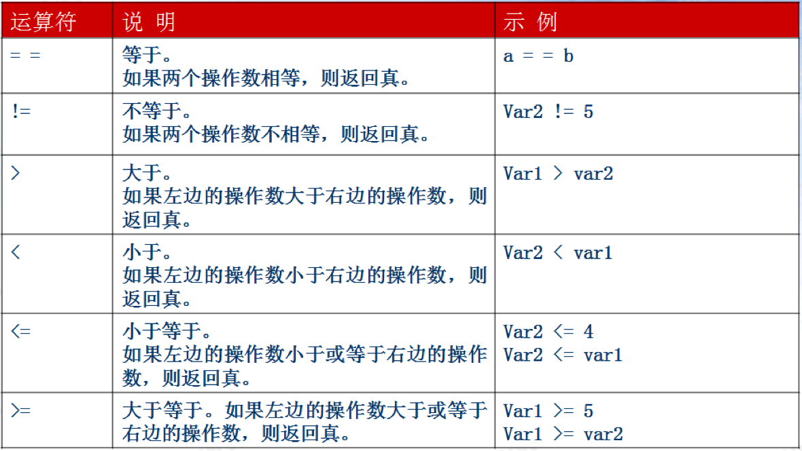
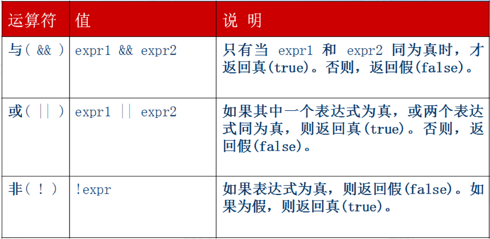

# 运算符与流程控制

## 一、运算符

### 1、一元运算符

+ 概述

  只能操作一个值的运算符叫做一元运算符

  ```javascript
  var a = ++b; //加后取值先执行加法运算, 再取值
  
  var a = b++; //加前取值先取值, 再执行加法运算
  ```

+ 其他类型应用一元运算符的规则

  ```javascript
  var b = '89'; 
  
  b++; //90,数值字符自动转换成数值
  
  var b= 'ab'; 
  
  b++; //NaN,字符串包含非数值转成NaN
  
  var b = false;
  
  b++;//1,false转成数值0,累加就是1
  
  var b = 2.3; 
  
  b++; //3.3,直接加1
  ```

### 2、算数运算符

+ 符号

  | 符号 | 说明     |
  | :--- | :------- |
  | +    | 加(连接) |
  | -    | 减       |
  | *    | 乘       |
  | /    | 除       |
  | %    | 取余     |

+ 实例

  ```javascript
  console.log(1 + 1);
  console.log(1 - 1);
  console.log(1 * 2);
  console.log(1 / 2);
  console.log(1 % 2);
  ```

+ 作为连接

  ```javascript
  console.log('a' + 'b')
  console.log('a' + 1)
  console.log('a' + [1,2,3])
  ```

### 3、关系运算符

+ 概述

  用于进行比较的运算符称作为关系运算符

+ 关系运算符如下:

  | 运算符 | 说明                 |
  | ------ | -------------------- |
  | `>`    | 大于                 |
  | `<`    | 小于                 |
  | `>=`   | 大于等于             |
  | `<=`   | 小于等于             |
  | `==`   | 等于(只判断值)       |
  | `===`  | 全等于(判断值和类型) |
  | `!=`   | 不等于(值判断值)     |
  | `!==`  | 不全等(值和类型)     |

  

+ 关系运算符的比较规则: 
  
  1. 数字和数字比较, 直接比较大小
  2. 数字和字符串比较, 字符串转换为数字后再比较（否则都为false）
  3. 字符串和字符串比较, 进行字符的ASCII码值比较
  
+ 字符与ASCII值互转

  ```javascript
  var str = "A";
  str.charCodeAt(); 
  var num = 97;
  String.fromCharCode(num);  // 'a'
  ```

+ 比较注意事项:
  + 布尔值 ture=1, false=0  `Number(true)`
  + 有NaN的运算都为false
  + 如果要恒等, 则必须值和类型都要相等;

+ 关系运算符(特殊值)

| 运算               | 结果  |
| :----------------- | :---: |
| null  == undefined | true  |
| 'NaN' == NaN       | false |
| 5  == NaN          | false |
| NaN  == NaN        | false |
| false  == 0        | true  |
| true  == 1         | true  |
| true  == 2         | false |
| undefined  == 0    | false |
| null  == 0         | false |
| '100'  == 100      | true  |
| '100'  === 100     | false |

### 4、逻辑运算符

+ 说明

  逻辑运算符通常用于布尔值的操作，一般和关系运算符配合使用，有三个逻辑运算符：逻辑与(AND)、逻辑或(OR)、逻辑非(NOT)
  
  

+ 注意
  + 逻辑与&&运算符属于短路操作，顾名思义，如果第一个操作数返回是false，第二个数不管是true还是false都会返回false。

  + 逻辑或||运算符也是短路操作。当第一操作数的求值结果为true， 就不会对第二个操作数求值了。 

  + 短路效果

    ```javascript
    var a = 1;
    console.log(a++ || true)
    console.log(a)
    console.log(true || a++)
    ```

+ 逻辑非(NOT)：! 
  + 概述

    逻辑非运算符可以用于任何值。无论这个值是什么数据类型，这个运算符都会返回一个布尔值。它的流程是：先将这个值转换成布尔值，然后取反，

  + 规则如下：
    + 操作数是一个空字符串,返回true;  非空字符串, 返回false 
    + 操作数是数值0,返回true;  任意非0数值(包括 Infinity),返回false
    + 操作数是NaN,  返回true
    + 操作数是undefined,  返回true

### 5、赋值运算符

+ 概述：

  赋值运算符用等于号(=)表示，就是把右边的值赋给左边的变量

  复合赋值运算符通过x=的形式表示，x表示算术运算符

+ 符号

  | 符号 | 说明                   |
  | ---- | ---------------------- |
  | =    | 赋值       a = b       |
  | +=   | 相加再赋值    a += b   |
  | -=   | 相减再赋值     a -= b  |
  | *=   | 相乘再赋值      a *= b |
  | /=   | 相除再赋值     a /= b  |
  | %=   | 取余再赋值     a % = b |

+ 实例

  ```javascript
  var a = 1;
  var b = 2;
  a += b;  //  a = a + b
  a -= b;  //  a = a - b
  a *= b;  //  a = a * b
  a /= b;  //  a = a / b
  a %= b;  //  a = a % b
  console.log(a);
  ```

### 6、三目运算符

+ 概述

  理解为if  else  的简写

+ 格式

  表达式？真：假;

  字符串运算符:  字符串运算符只有一个，即：“+”。它的作用是将两个字符串相加。规则：至少一个操作数是字符串

+ 实例

   ```javascript
    var res = a > b?'a大于b':'a不大于b';
   ```

## 二、流程控制

### 1、结构分类

+ 顺序：从上朝下执行的代码就是顺序

+ 分支(选择)：根据不同的情况，执行对应代码

+ 循环：重复做一件事情

### 2、顺序结构

   顺序结构是最简单的程序结构，它是由若干个依次执行的处理步骤组成的。如图，A语句和B语句是依次执行的，只有在执行完A语句后，才能接着执行B语句。

### 3、分支结构

+ 概述

  在处理实际问题时，只有顺序结构是不够的，经常会遇到一些条件的判断，流程根据条件是否成立有不同的流向。如下图所示，程序根据给定的条件P是否成立而选择执行A操作或B操作。这种先根据条件做出判断，再决定执行哪一种操作的结构称为分支结构，也称为选择结构。

+ IF单分支

  if条件判断语句的写法:

  ```javascript
  if(表达式){
    执行语句
  }
  ```

  当括号内的表达式结果成立(为true时)，则执行大括号内的语句，否则不执行。

  + 注意

    if后面的()不能省略。

    一条执行语句可以省略{}, 多条时不能省略{}, 建议不管是一条还是多条都写上{}

  + 简写

    ```javascript
    if(0>1)
       console.log('大于')
    if(0>1) console.log('大于')
    ```

+ IF双分支语句      

  格式

  ```javascript
  if(表达式){
    执行语句1
  }else{
    执行语句2
  }
  ```

  当if括号内的表达式结果成立，执行执行语句1，否则执行执行语句2;

  + 判断一个年份是闰年还是平年；

    能被4整除而不能被100整除.（如2004年就是闰年,1800年不是.）     

    能被400整除.（如2000年是闰年））

  + 简写

    ```python
    if(0>1)
    	console.log('大于')
    else
    	console.log('不大于')
    ```

+ IF多分支语句

   if多分支语句的写法:

  ```javascript
  if(表达式){
  	执行语句1
   } 
   else if(表达式2){
  	执行语句2
   }
   else if(表达式3){
  	执行语句3
   }
   else{
  	执行语句n
   }
  ```

   从上往下，满足哪个条件就执行其相对应的语句，都不满足时，执行最后的

  else

  的语句，只能进入其中之一

  + IF的嵌套

  ​    将整个if语句块插入另一个if语句块中

  ```javascript
  if (表达式1) {
       if (表达式2)  {
         if (表达式3){
               语句;
         }
   	  else{
  	       语句;
       }
  }
    else{
          语句;
    }
  }
  ```

  注意:嵌套if时，最好不要超过三层； 内层的每一对if...else代码要缩进且对齐；编写代码时，else要与最近的if配对。

### 4、switch语句

+ 格式

  ```javascript
  switch(表达式) {
       case 常量1:语句; break;
       case 常量2:语句; break;
       case 常量n:语句; break;
       default:语句; break;
  }
  ```

+ 概述

  表达式的结果等于哪个case的常量，则执行其后的语句，执行完break就跳出switch结构，都不满足则执行default的语句。

+ break的作用

  是跳出switch结构，如果没有break，则继续执行下面分支的的语句（而不进行判断）。

+ 注意case穿透，要加break

  switch的应用场景:表达式为固定值,不能判断范围

### 5、循环结构

+ 概述

​      需要重复执行同一操作的结构称为循环结构，即从某处开始，按照一定条件反复执行某一处理步骤，反复执行的处理步骤称为循环体

+ 循环的分类
  + while循环
  + do-while循环
  + for循环
    + for  in
    + for of
    + forEach

#### 5.1 while循环

+ 语法格式

  ```javascript
  while(表达式)
  {
      执行代码;
  }
  ```

+ 注意:  

  1.  while循环必须按照上述语法格式来写, 只能更改表达式内容和执行代码.
  2. 表达式可以是常量,变量或者其他表达式,该表达式会被强制转换为boolean类型, 可以理解表达式就是循环的条件.
  3. 执行代码可以有多行, {}所包含的称为循环体.
  4. 表达式不要一直是true, 避免死循环.
  5.  while循环的顺序是: 先判断表达式是否为true, 若true则执行执行代码, 然后再继续判断表达式是否为true, ….  直到判断表达式为false才会跳出循环, 执行while后面的代码
  6. while循环一般会有: 循环初始值, 循环条件 和 循环变量增量(或者减量)

+ 练习

  + 循环三角形

  + 打印100以内 7的倍数

  + 打印100以内的奇数

  + 打印100以内所有偶数的和

  + 打印图形

    ```
    * * * * * * * * * *
    * * * * * * * * * *
    * * * * * * * * * *
    * * * * * * * * * *
    ```

#### 5.2 do while循环

+ 结构

  ```javascript
  do{
    
  }while();
  ```

+ 注意

  会多循环一次

  因为do while语句为先执行后判断

+ 实例 

  左侧正三角形

  ```javascript
  var j=1;
  do{
    var i=1;
    do{
      document.write(i)
      i++
    }while(i<=j);
    document.write('<br>')
    j++
  }while(j<=9);
  ```

  右侧正三角形

  ```javascript
  <script>
      var a = 1;
      do{
  
          var k = 1;
          do{
              if(a==9){
                  break
              }
              document.write('&nbsp;&nbsp;&nbsp');
              k++;
          }while(k<=9-a);
          var i = 1;
          do{
              document.write(i+' ');
              i++;
          }while(i<=a);
          document.write('<br>');
          a++;
      }while(a<10);
  </script>
  ```

  右侧倒三角形

  ```javascript
  //右侧倒三角线
  var j=9;
  do{
    //控制空格字符的输出
    var k = 9-j;
    do{
      if(j==9){
        break;
      }
      document.write('*');
      k--;
    }while(k>=1);
    //输出右侧三角形的元素
    var i = j;
    do{
      document.write(i);
      i--;
    }while(i>=1);
    document.write('<br />'); //控制行的输出
    j--;
  }while(j>=1);
  ```

#### 5.3 for循环语法格式

+ 主体结构

```javascript
for (表达式1; 表达式2;表达式3){
       执行代码;
}
```

+ 实例

```javascript
for(var i=0;i<5;i++){
  console.log(i)
}
for循环将 循环初始值, 循环条件, 循环变量增量写在了一起
注意: 三个表达式都是可选填写, 但是如果后两个不写,会造成死循环; 而第一个为初始化值,所以我们三个一般都要写上.
```

+ 简写

```javascript
var i=1;
for(;;){
  if(i>100){
    break;
  }
  document.write(i+'<br />');
  i++;            
}
```

+ 实例
  
  ```javascript
  for (var e, r, i, n, o = "", a = t.length % 3, s = 0; s < t.length; ) {
              if ((r = t.charCodeAt(s++)) > 255 || (i = t.charCodeAt(s++)) > 255 || (n = t.charCodeAt(s++)) > 255)
                  throw new TypeError("invalid character found");
              o += dt[(e = r << 16 | i << 8 | n) >> 18 & 63] + dt[e >> 12 & 63] + dt[e >> 6 & 63] + dt[63 & e]
          }
  ```
  
  转变成
  
  ```javascript
  var e, r, i, n, o = "", a = t.length % 3, s = 0
  for (; s < t.length; ) {
      if ((r = t.charCodeAt(s++)) > 255 || (i = t.charCodeAt(s++)) > 255 || (n = t.charCodeAt(s++)) > 255)
          throw new TypeError("invalid character found");
      o += dt[(e = r << 16 | i << 8 | n) >> 18 & 63] + dt[e >> 12 & 63] + dt[e >> 6 & 63] + dt[63 & e]
  }
  ```
  
  
  
+ 注意: 
  
  + 表达式1:可写循环初始值, (可以不填)
  + 表达式2: 循环条件
  + 表达式3: 循环增量(减量)
  + 两个分号必须写.

#### 5.4 for  in   返回索引值

```javascript
for(var i in Array){
  console.log(i)
}
```

使用

```javascript
const arr = [1,2,3,4]

for (const key in arr){
    console.log(key) // 输出 0,1,2,3
}
```

#### 5.5 for  of  返回值

```javascript
for(var i of Array){
  console.log(i)
}
```

使用

```javascript
const arr = [1,2,3,4]

for (let v of arr){
    console.log(v) // 输出 1,2,3,4
}
```

#### 5.6 forEach  返回值

```javascript
Array = [1,2,3,4]
Array.forEach(function(arg){
  console.log(arg)
});
```


### 6、关键字break和continue

+ break关键字

  + 在switch语句中使流程跳出switch结构。

  + 在循环语句中使流程跳出当前循环

    注意:

    如果已执行break语句，就不会执行循环体中位于break后的语句。

    在多层循环中，一个break语句只向外跳一层

+ continue关键字

  只能在循环语句中使用，使本次循环结束，即跳过循环体中下面尚未执行的语句，接着进行下次是否执行循环的判断。

  注意:

  + continue语句只能用在循环里。
  + 对于while和do-while循环，continue语句执行之后的动作是条件判断；对于for循环，随后的动作是变量更新。