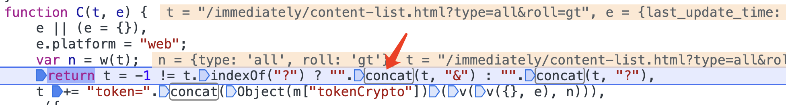
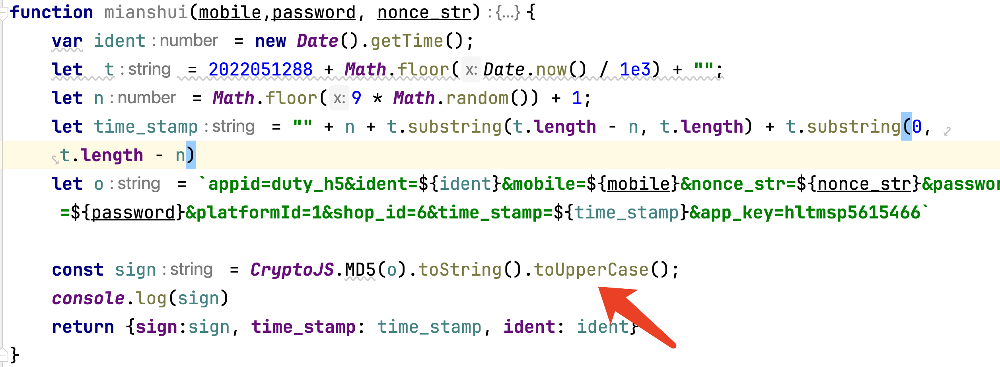

# 字符串

## 一、字符串的属性

+ 字符串的属性

  **length**:  表示字符串的长度

   例如 :  

  ```javascript
  var str = "howareyou";
  console.log(str.length);
  console.log(str[0]);  //获取字符串中对应下标的字符
  ```

+ **注意**: ECMAScript 中的字符串是不可变的; 也就是说，字符串一旦创建，它们的值就不能改变.

   例如:

  ```javascript
  var str = "亲,包邮哦";
  str[0] = "lucky"; //不会改变
  ```

  如果要改变某个变量保存的字符串，首先要销毁原来的字符串，然后再用另一个包含新值的字符串填充该变量.

  ```javascript
  var str = "Hello";
  str = str + " world!";
  ```

### 1、字符串使用

+ 概述

  在js中 使用单引号或者双引号的类型为字符串类型

+ 创建

  var str = ''

  ```javascript
  var str = 'abcefg'
  console.log(typeof str);
  console.log(str.length);
  ```

+ 属性

  + length   获取字符串的长度

    ```javascript
    var str = 'abcefg'
    console.log(str.length); 
    ```

    对于字符串 length只可以获取长度不能更改长度

+ 读取

  str[索引值]

  ```javascript
  console.log(str[0]);
  ```

  **注意：**字符串索引所对应的值只能获取  不能更改

### 2、字符串的格式化

**使用反引号实现**

ES6 模板字符串(Template String)是增强版的字符串，用反引号(`)标识，它可以当作普通字符串使用，也可以用来定义多行字符串，或者在字符串中嵌入变量。

语法格式：

```javascript
`想要输出的字符串……${变量名称}想要输出的字符串……${变量名称}`
```

实例

```javascript
<script>
   var name = "lucky";
   var age = 25;
   var sex = "男";
   console.log(`大家好，我叫${name}，性别${sex},今年${age}岁了`);
</script>
```


### 3、字符串的方法

字符串的方法(函数)

```javascript
var str = 'abcd';
```

+ **str.charAt(3)**           获取下标为3的字符

+ **str.charCodeAt(3)**  获取下标为3的字符的编码(ASCII码)  不给参数则默认第一位

+ **String.fromCharCode(94)**  ASCII编码转换成字符

  该方法是String的静态方法，所以用String调用，       

  如：var str = String.fromCharCode(98,99); //可传入多个参数

  ASCII（AmericanStandard Code for Information Interchange，美国标准信息交换代码）

+ **str.concat()** 连接字符串

  例如:

  ```javascript
  var str1 = "hello";

  var str2 = str1.concat(" world");
  ```

  

+ 字符串的查找方法

  **str.indexOf("abc")**  查找字符串第一次出现的位置,如果没找到则返回-1

   例如:  

  ```python
  var str = "abcdabcd";
  var subStr = "bcd";
  var index = str.indexOf(subStr); 
  ```

+ **str.lastIndexOf("abc")**  查找字符串最后一次出现的位置,如果没找到则返回-1

​    例如: `var index = str.lastIndexOf("abc");`

+ **str.search();** 正则匹配(返回第一次出现的位置)

  例如:

  ```javascript
  var str = "Abcdabcd";
  var index = str.search(/abc/ig);
  ```

  注: g表示进行全局匹配，i表示匹配的时候忽略大小写

+ **str.replace()** 替换字符串

  例如:

  ```javascript
  var str = "how are Are are you!";
  //替换一次
  var newStr = str.replace("are", "old are");
  //替换多次
  var newStr = str.replace(/are/g, "x");
  console.log(newStr)
  ```

  这里的替换只能执行一次，不能够进行全局匹配，如果需要全局匹配，则应使用正则表达式

+ **str.substring(start,end)** 截取字符串范围是[start,end)

  例如:

  ```javascript
  var str=  "Helloworld!";
  console.log(str.substring(2,5));
  ```

  注:如果只有一个参数, 则表示到字符串最后  不包含end

+ **str.split(separator, howmany)**  根据分隔符、拆分成数组

  + separator(字符串或正则表达式)

  + howmany(可以指定返回的数组的最大长度,可以省略)

  ```javascript
  var str=  "Helloworld!";
  console.log(str.split(''));
  ```

​      注:如果空字符串("")用作separator,那么stringObject中的每个字符之间都会被分割。

+ 大小写转换

  **str.toLowerCase()**   把字符串转换成小写

  **str.toUpperCase()**   把字符串转换成大写

  

### 4、**混淆案例**

+ 示例一

  ```javascript
  let d = function(){
      console.log('lucky is a good man')
  }
  var str = 'abcd123';
  let a = String.fromCharCode(str[String['fromCharCode']('a'.charCodeAt()+'\x02'.charCodeAt())+'harCodeAt'](3))+'()';
  eval(a)
  ```

+ 示例二

  ```javascript
  // 原始字符串
  var originalString = "Hello, World!";

  // 将每个字符的 Unicode 值保存在数组中
  var charCodes = [];
  for (var i = 0; i < originalString.length; i++) {
    charCodes.push(originalString.charCodeAt(i));
  }

  // 使用 String.fromCharCode将数组转换回字符串
  var obfuscatedString = String.fromCharCode(...charCodes);

  console.log(obfuscatedString);
  ```

  **扩展运算符**：这种用法通常用于动态地将字符码数组转换为字符串，特别是当字符码的数量不确定或动态生成时。在现代 JavaScript 中，更常见的是使用扩展运算符（`...`）来达到相同

+ 示例三 （重度混淆）

  ```javascript
  eval(function(p,a,c,k,e,d){e=function(c){return(c<a?'':e(parseInt(c/a)))+((c=c%a)>35?String.fromCharCode(c+29):c.toString(36))};if(!''.replace(/^/,String)){while(c--)d[e(c)]=k[c]||e(c);k=[function(e){return d[e]}];e=function(){return'\\w+'};c=1};while(c--)if(k[c])p=p.replace(new RegExp('\\b'+e(c)+'\\b','g'),k[c]);return p}('1.4(\'5 3 0 2 6\')',62,7,'a|console|good|is|log|lucky|man'.split('|'),0,{}))
  ```


## 二、正则表达式的概念

### 1、正则表达式修饰符

修饰符 可以在全局搜索中不区分大小写:

| 修饰符  | 描述                           |
| ---- | ---------------------------- |
| i    | 执行对大小写不敏感的匹配。                |
| g    | 执行全局匹配（查找所有匹配而非在找到第一个匹配后停止）。 |
| m    | 执行多行匹配。                      |

### 2、正则表达式模式

方括号用于查找某个范围内的字符：

| 表达式    | 描述               |
| ------ | ---------------- |
| [abc]  | 查找方括号之间的任何字符。    |
| [0-9]  | 查找任何从 0 至 9 的数字。 |
| (x\|y) | 查找任何以 \| 分隔的选项。  |

### 3、元字符

+ 概述

  元字符是拥有特殊含义的字符：

| 元字符    | 描述                            |
| ------ | ----------------------------- |
| \d     | 查找数字。                         |
| \D     | 非数字                           |
| \w     | 数字字母下划线                       |
| \W     | 非数字字母下划线                      |
| \s     | 查找空白字符。                       |
| \b     | 匹配单词边界。                       |
| \uxxxx | 查找以十六进制数 xxxx 规定的 Unicode 字符。 |

中文的 Unicode 范围通常是 `\u4e00-\u9fa5`，包括了常用的汉字。

```javascript
// 使用正则表达式匹配中文字符
var chineseCharacters = "你好，世界！";
var chineseRegex = /[\u4e00-\u9fa5]/g;
var result = chineseCharacters.match(chineseRegex);
console.log(result); // 输出: ["你", "好", "世", "界"]
```

### 4、量词

| 量词   | 描述                    |
| ---- | --------------------- |
| n+   | 匹配任何包含至少一个 *n* 的字符串。  |
| n*   | 匹配任何包含零个或多个 *n* 的字符串。 |
| n?   | 匹配任何包含零个或一个 *n* 的字符串。 |

### 5、方法

+ match 方法 

  使用正则表达式模式对字符串执行查找，并将包含查找的结果作为数组返回。 
  stringObj.match(rgExp) 

  + 参数 
    stringObj 
    必选项。对其进行查找的 String 对象或字符串文字。 
    rgExp 
    必选项。为包含正则表达式模式和可用标志的正则表达式对象。也可以是包含正则表达式模式和可用标志的变量名或字符串文字。 
    其余说明与exec一样，不同的是如果match的表达式匹配了全局标记g将出现所有匹配项，而不用循环，但所有匹配中不会包含子匹配项。

  + 实例

    ```javascript
    var str="Hello world!"
    document.write(str.match("world") + "<br />")
    document.write(str.match("World") + "<br />")
    document.write(str.match("worlld") + "<br />")
    document.write(str.match("world!"))
    document.write(str.match("[a-z]{5}") + "<br />")
    输出：
    world
    null
    null
    world!
    world
     
    var str="1 plus 2 equal 3"
    console.log(str.match(/\d+/g)) // [1,2,3]
    ```

+ exec 方法 

  是一个正则表达式方法。

  该方法用于检索字符串中的正则表达式的匹配。

  该函数返回一个数组，其中存放匹配的结果。如果未找到匹配，则返回值为 null。
  rgExp.exec(str) 

  + 实例

  ```javascript
  /e/.exec("The best things in life are free!");
  /[a-z]/i.exec("The best things in life are free!");
  ```

+ test 方法 

  test() 方法用于检测一个字符串是否匹配某个模式，如果字符串中含有匹配的文本，则返回 true，否则返回 false。
  rgexp.test(str) 

  + 实例

  ```javascript
  var patt = /e/;
  patt.test("The best things in life are free!");

  /^1[3-8][0-9]{9}$/.test('15611833906')
  ```

+ search 方法 

  search 方法可使用字符串作为参数。字符串参数会转换为正则表达式：

  返回与正则表达式查找内容匹配的第一个子字符串的位置（偏移位）。 
  stringObj.search(rgExp) 

  + 实例

  ```javascript
  var str="Visit lucky!"
  document.write(str.search(/lucky/i))
  ```

+ replace 方法 

  返回根据正则表达式进行文字替换后的字符串的复制。 
  stringObj.replace(rgExp, replaceText) 

  + 实例

    ```javascript
    <p>替换 "张三" 为 "lucky" :</p>
    <button onclick="myFunction()">点我</button>
    <p id="demo">Visit 张三!</p>
    <script>
        function myFunction() {
            var str = document.getElementById("demo").innerHTML;
            var txt = str.replace(/张三/i,"lucky");
            document.getElementById("demo").innerHTML = txt;
        }
    </script>
    ```

+ split 方法 

  将一个字符串分割为子字符串，然后将结果作为字符串数组返回。 
  stringObj.split([separator[, limit]]) 

  + 说明 
    split 方法的结果是一个字符串数组，在 stingObj 中每个出现 separator 的位置都要进行分解。separator 不作为任何数组元素的部分返回。

  + 实例

    ```javascript
    '156118 339\t06'.split(/\s/)
    ```

+ 正则匹配实例

  ```javascript
  //.号元字符, 代表除了换行之外的所有单个字符
  var pattern = /g..gle/;   //一个点.匹配一个任意的字符
  var str = "goagle";
  console.log(pattern.test(str));

  //*号元字符, 配合其他字符使用, 允许其他字符出现任意多次
  // 重复多次匹配, 可以出现任意次, 
  var  pattern = /g.*gle/; //.* 匹配0到多个字符
  var  str = "google" 
  console.log(pattern.test(str)); 

  // [ ] : 表示字符可以出现的范围
  //[a-z]*表示任意0到多个a-z的字母
  var pattern = /g[a-z]*gle/;
  var str = "google";
  console.log(pattern.test(str));

  //非字符:  ^
  var pattern = /g[^0-9]*gle/; //可以有任意多个非0-9的字符
  var str = "google";
  console.log(pattern.test(str)); 
  			
  //+ 表示至少出现1次
  //[A-Z]+: 至少出现一个A-Z的字符
  var pattern = /[a-z][A-Z]+/;
  var str = "gooGle";
  console.log(pattern.test(str)); 
  			
  //使用元符号匹配
  //\w* :匹配任意多个数字字母下划线 , \w : 等价于[a-zA-Z0-9_] 
  var pattern = /g\w*gle/;
  var str = "gooA3gle";
  console.log(pattern.test(str));

  //\d 代表数字, 等价于 [0-9]
  //\d* 表示任意多个数字
  var pattern = /g\d*gle/;
  var str = "g3243gle";
  console.log(pattern.test(str)); 
  			
  //\D: 匹配非数字, 相当于[^0-9]
  var pattern = /g\Dgle/;
  var str = "ga3gle";
  console.log(pattern.test(str)); 
  			
  //\D{7,}: 匹配至少7个非数字, 相当于[^0-9]{7,}
  var pattern = /\D{7,}/;
  var str = "g3243gle";
  console.log(pattern.test(str)); 

  /使用锚元字符
  // /^ 匹配开始,从头开始匹配
  // $/ 匹配结尾,从结尾开始匹配
  var pattern = /^google$/;
  var str = "google";
  console.log(pattern.test(str));
  			
  // \s 匹配空格
  var pattern = /goo\sgle/;
  var str = "goo gle";
  console.log(pattern.test(str));

  //m 多行匹配
  var str = "first second\nthird fourth\nfifth sixth";
  var patt = /\w+$/gm
  var patt = /\w+/gm
  console.log(str.match(patt));
  ```


​      