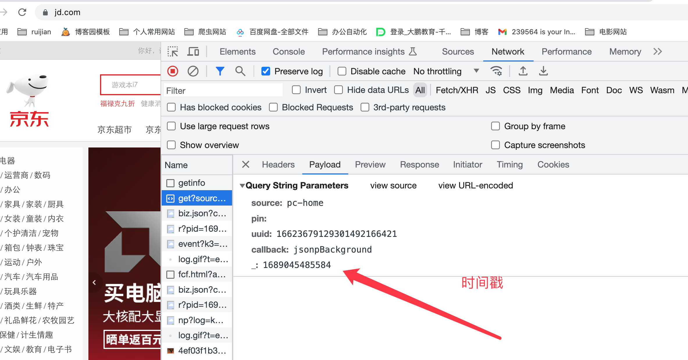

# 对象Object

## 一、概述与创建

### 1、概述

什么是对象，其实就是一种类型，即引用类型。而对象的值就是引用类型的实例。在
ECMAScript 中引用类型是一种数据结构，用于将数据和功能组织在一起。

### 2、对象的创建

**Object类型** 

+ 创建 Object 类型有两种。

  + 使用 new 运算符
  + 字面量表示法

+ 使用new 运算符创建 Object 

  ```javascript
  var box = new Object();        // new方式  
  box.name = 'lucky';            // 创建属性字段    
  box.age = 18;                  // 创建属性字段
  var box = Object();            // new关键字可以省略   不建议
  ```

+ 使用字面量方式创建Object

  ```javascript
  var box = {                   // 字面量方式
      name :'lucky',            // 创建属性字段,最后加逗号
      age : 18,
      fun:function(){
        alert('lucky is a good man ');
      }
  };
  ```

+ 属性字段也可以使用字符串形式

  ```javascript
  var box = { 
    'name': 'lucky',    //也可以用字符串形式
    'age': 28
  };
  ```

+ 使用字面量及传统赋值方式

  ```javascript
  var box = {};         //字面量方式声明空的对象
  box.name = 'lucky';   //点符号给属性赋值
  box.age = 18;
  ```

+ 两种属性输出方式

  ```javascript
  console.log(box.age);       //点表示法输出 
  console.log(box['age']);    //中括号表示法输出，注意引号
  ```

+ 对象创建方法

  ```javascript
   varbox={ 
    //对象中添加方法(函数)run
    run: function() {        
            retrun "正在跑步..";
    		}
   }
   alert(box.run()); //调用对象中的方法
  ```

+ 使用**delete** 删除对象属性 

  delete box.name;     //删除属性

+ **instanceof**  符用于检测构造函数的属性是否出现在某个实例对象的原型链上。

  ```javascript
  function a(){
  }
  x = new a()
  console.log(x instanceof a)
  ```

+ 在 JavaScript 中，ES2015（也称为ES6）引入了一种新的语法，称为“简写属性名”（Shorthand Property Names），使得在对象字面量中创建属性和值相同的情况更加简洁。

  ```javascript
  // 使用简写属性名创建对象
  var name = "lucky";
  var age = "18";
  var myObject = {
    name,
    age,
  };
  console.log(myObject);
  ```

+ 对象中属性赋值给变量

  ```javascript
  let obj = {'name':'lucky', 'age':18}
  let {name,age} = obj
  console.log(name, age)
  ```

  **注意：** 当前对象中属性和变量名称需要相同

### 3、注意

javaScript 对象允许使用方括号 `[]` 来访问对象的属性值。这种语法允许你使用变量或字符串作为属性名。

+ 内置方法的使用方式

  ```javascript
  var a = 'lucky'
  a[2]          // 获取索引为2的字符
  a.charAt(2) 
  a['charAt'](2)
  
  var arr = []
  arr.push(1)
  arr['push'](1)
  ```

  同样可以使用点或者中括号的方式进行调用

+ 常常用于加密 (当前加密的不断演变)

  ```javascript
  a['charAt'](2)
  ```
  
  ```javascript
  a[String.fromCharCode(99)+'har'+String.fromCharCode(65)+'t'](2)
  ```

  ```javascript
  a[String['fromCharCode'](99)+'har'+String.fromCharCode(65)+'t'](2)
  ```
  
  ```javascript
  a[String['fromChar'+String['fromCharCode'](67)+'ode'](99)+'har'+String.fromCharCode(65)+'t'](2)
  ```
  
  ```javascript
  a[String['fromChar'+String['fromCharCode'](1067-0x3e8)+'ode'](99)+'har'+String.fromCharCode(65)+'t'](2)
  ```
  
  

## 二、日期对象Date

### 1、Date对象代表日期

Date类型使用自UTC（CoordinatedUniversal Time，国际协调时间）1970年1月1日午夜（零时）开始经过的毫秒数来保存日期。Date类型保存的日期能够精确到1970年1月1日之前或之后的285616年。

+ 创建一个日期对象，使用 new运算符和Date构造方法(构造函数)即可。

  ```javascript
  var d = new Date(); 
  //或者
  var d = new Date;
  ```

  在调用Date构造方法而不传递参数的情况下，新建的对象自动获取当前的时间和日期。

+ 创建日期对象并指定时间

  ```javascript
  var date = new Date("2024/08/22");
  
  var date = new Date(2024,04,13,14,34);
  ```

  【注】日期的格式可以是“2024/08/22”，“2024-08-22”，或1970年当前日期的毫秒数

+ 方法


| 方法                                    | 说明                                                 |
| --------------------------------------- | ---------------------------------------------------- |
| console.log(date.toDateString());       | 以特定的格式显示星期几、月、日和年                   |
| console.log(date.toTimeString());       | 以特定的格式显示时、分、秒和时区                     |
| console.log(date.toLocaleDateString()); | 以特定地区格式显示年、月、日                         |
| console.log(date.toLocaleTimeString()); | 以特定地区格式显示时、分、秒                         |
| console.log(date.toUTCString());        | 以特定的格式显示完整的 UTC 日期: 年,月,日,时,分,秒。 |
| console.log(date.toDateString());       | 以特定的格式显示星期几、月、日和年                   |

### 2、日期对象Date

+ setDate() / getDate()       从Date对象中返回一个月中的某一天(1~31)
+ getDay()                            从Date对象返回一周中的某一天(0~6)
+ set/ getMonth()                从Date对象中返回月份(0~11)
+ set/ getFullYear()             从Date对象以四位数返回年份
+ set/ getHours()                 返回Date对象的小时(0~23)
+ set/ getMinutes()             返回Date对象的分钟(0~59)
+ set/ getSeconds()             返回Date对象的秒数(0~59)
+ set/ getMilliseconds()      返回Date对象的毫秒
+ **set/ getTime()                    返回1970年1月1日至今的毫秒数（重点）**  
+ getTimezoneOffset()        返回本地时间与格林尼治标准时间(GMT)的分钟差

注意：

Ø月份是从0-11，所以取得的值要加1才是当前月份

Ø星期天是从0-6, 0代表星期天  

**重点**

对于我们爬虫来说重点是时间戳的获取

+ new Date().getTime()     
+ Date.now()





## 三、定时器与定时执行

### 1、定时器

+ 概述

  **setInterval()**  方法可按照指定的周期（以毫秒计）来调用函数或计算表达式

  **setInterval() ** 方法会不停地调用函数，直到clearInterval()被调用或窗口被关闭。由setInterval()返回的ID值可用作clearInterval()方法的参数。

+ 创建定时器

  **setInterval(code,millisec)**

  参数

  + code 是要调用的代码块或者函数

  + millisec 是周期性执行代码块或函数的间隔，以毫秒计

+ 实例 

  创建定时器timer,每隔1秒调用一次函数function

  ```javascript
  var timer = setInterval( function(){},1000);
  ```

+ 关闭定时器

  ```javascript
  clearInterval(timer);
  ```

+ 显示时间

  ```javascript
  <body>
      <p>时间：<span id="show"></span></p>
      <button onclick="stop()">暂停</button>
  <script>
      var s = document.getElementById('show');
      var timer = setInterval(function () {
          var box = new Date();
          s.innerHTML = box.toLocaleDateString()+' '+box.toLocaleTimeString();
      },1);
      function stop() {
          clearInterval(timer);
      }
  </script>
  </body>
  ```

​	**注意：** 对于爬虫来说 常用于检测是否开启的调试模式 F12

​	

### 2、定时执行一次

+ 概述

  **setTimeout()**方法可按照指定的毫秒来定时执行 来调用函数或计算表达式

+ 创建定时器

  **setTimeout(code,millisec)**

  code 是要调用的代码块或者函数

  millisec 毫秒

+ 实例

  创建定时执行器timer,每隔1秒调用一次函数function

  ```javascript
  var timer = setTimeout( function(){},1000);
  ```

+ 关闭定时器

  ```javascript
  clearTimeout(timer);
  ```
  
  

