# Javascript进阶

## 一. 变量提升(不正常现象)---回顾

### 1、前情摘要

看以下代码, 或多或少会有些问题的.

```js
function fn(){
    console.log(name);
    var name = 'lucky';
}
fn()
```

发现问题了么. 这么写代码, 在其他语言里. 绝对是不允许的. 但是在js里. 不但允许, 还能执行. 为什么呢?  因为在js执行的时候. 它会首先检测你的代码.  发现在代码中会有name使用. OK. 运行时就会变成这样的逻辑:

```js
function fn(){
    var name;
    console.log(name);
    name = 'lucky';
}
fn()
```

### 2、解决

看到了么. 实际运行的时候和我们写代码的顺序可能会不一样....这种把变量提前到代码块第一部分运行的逻辑被称为变量提升. 这在其他语言里是绝对没有的. 并且也不是什么好事情. 正常的逻辑不应该是这样的. 那么怎么办?  在新的ES6中. 就明确了, 这样使用变量是不完善的. es6提出. ==用let来声明变量.let变量不可以变量提升.== 就不会出现该问题了. 

+ 实例

  ```javascript
  function fn(){
      console.log(name);  // 直接报错, let变量不可以变量提升.
      let name = 'lucky'; 
  }
  fn()
  ```


### 3、let扩展

结论一, 用let声明变量是新版本javascript提倡的一种声明变量的方案

let还有哪些作用呢?  

```js
function fn(){
    var name = "lucky";
    var name = "王力宏";
    console.log(name);
}
fn()
```

显然一个变量被声明了两次. 这样也是不合理的. var本意是声明变量. 同一个东西. 被声明两次. 所以ES6规定. let声明的变量. 在同一个作用域内. 只能声明一次. 

```js
function fn(){
    let name = "lucky";
    let name = "王力宏";
    console.log(name);
}
fn()
```

注意, 报错是发生在代码检查阶段. 所以. 上述代码根本就执行不了. 

结论二, 在同一个作用域内. let声明的变量只能声明一次. 其他使用上和var没有差别 


## 二. 进阶操作(非交互)

### 1、 eval函数

+ eval使用

  eval本身在js里面正常情况下使用的并不多. 但是很多网站会利用eval的特性来完成反爬操作. 我们来看看eval是个什么鬼?  

  从功能上讲, eval非常简单. 它和python里面的eval是一样的. 它==可以动态的把字符串当成js代码进行运行==. 

  ```javascript
  s = "console.log('lucky is a good man')";
  eval(s);
  ```

  也就是说. eval里面传递的应该是即将要执行的代码(字符串). 那么在页面中如果看到了eval加密该如何是好?  其实只要记住了一个事儿. 它里面不论多复杂. 一定是个字符串. 

  比如,

  ```javascript
  eval(eval(function(p,a,c,k,e,d){e=function(c){return(c<a?'':e(parseInt(c/a)))+((c=c%a)>35?String.fromCharCode(c+29):c.toString(36))};if(!''.replace(/^/,String)){while(c--)d[e(c)]=k[c]||e(c);k=[function(e){return d[e]}];e=function(){return'\\w+'};c=1};while(c--)if(k[c])p=p.replace(new RegExp('\\b'+e(c)+'\\b','g'),k[c]);return p}('1.4("5 3 0 2 6")',62,7,'a|console|good|is|log|lucky|man'.split('|'),0,{})))
  ```

  这一坨看起来, 肯定很不爽. 怎么变成我们看着很舒服的样子呢?  记住. eval()里面是字符串. 记住~!!

  那我想看看这个字符串长什么样?  就把eval()里面的东西拷贝出来. 执行一下. 最终一定会得到一个字符串. 要不然eval()执行不了的. 对不...于是就有了下面的操作.

  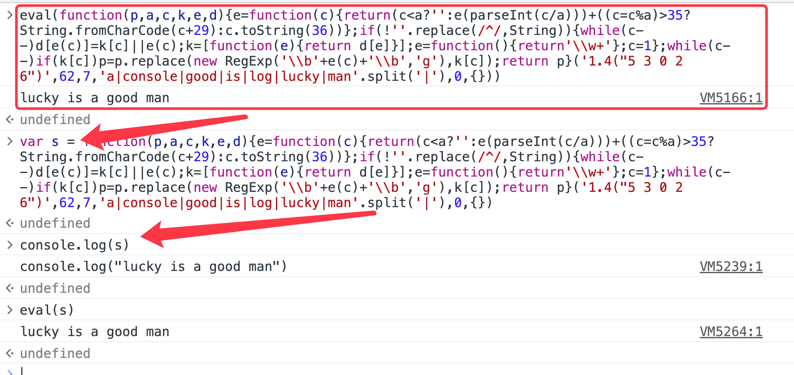

  http://tools.jb51.net/password/evalencode, 在赠送你一个在线JS处理eval的网站. 大多数的eval加密. 都可以搞定了. 

  **注意**
  eval的参数一定是字符串

+ 实际案例

  **网址：**https://www.aqistudy.cn/historydata/monthdata.php?city=%E4%B8%9C%E8%8E%9E

  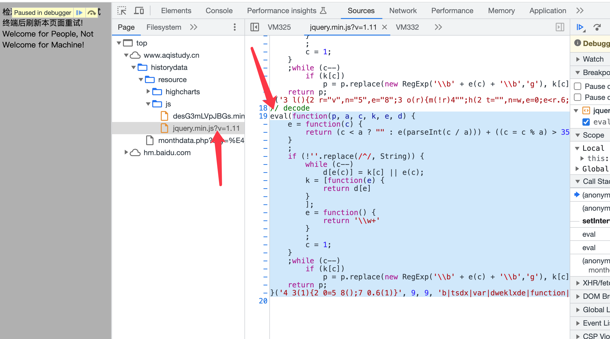

  代码

  ```javascript
  eval(function(p, a, c, k, e, d) {
      e = function(c) {
          return (c < a ? "" : e(parseInt(c / a))) + ((c = c % a) > 35 ? String.fromCharCode(c + 29) : c.toString(36))
      }
      ;
      if (!''.replace(/^/, String)) {
          while (c--)
              d[e(c)] = k[c] || e(c);
          k = [function(e) {
              return d[e]
          }
          ];
          e = function() {
              return '\\w+'
          }
          ;
          c = 1;
      }
      ;while (c--)
          if (k[c])
              p = p.replace(new RegExp('\\b' + e(c) + '\\b','g'), k[c]);
      return p;
  }('4 3(1){2 0=5 8();7 0.6(1)}', 9, 9, 'b|tsdx|var|dweklxde|function|new|decode|return|Base64'.split('|'), 0, {}));
  ```

  将eval中的函数复制出来 添加括号进行自调用运行

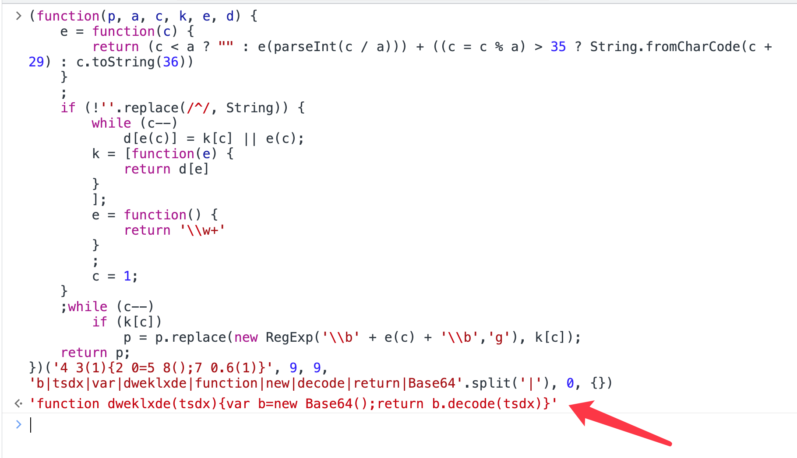

   


### 2、ES6中的新简洁语法

+ 箭头函数

  在ES6中简化了函数的声明语法.   

  ```javascript
  // 无参函数
  var fn = function(){};  // 普通写法
  var fn = () => {};      // 简洁写法

  // 一个参数函数
  var fn = function(name){}  // 普通写法
  var fn = name => {}       // 简洁写法 一个参数可以省略小括号
  var fn = (name) => {}     // 简洁写法

  // 多个参数函数
  var fn = function(name, age){}  // 普通写法
  var fn = (name, age) => {}      // 简洁写法
  ```

+ 对象简写

  如果属性和值为同一个名称可以按照如下写法进行简化

  ```javascript
  var name = 'lucky';
  function speak(){
    console.log("lucky is a good man")
  }
  var obj = {
    name: name,
  }
  // 简洁写法
  var obj = {
    name,
    speak,
  }
  ```

  内部方法的简洁写法

  ```javascript
  // 普通写法
  var obj = {
    speak: function(){
    	console.log("lucky is a good man")
  	},
  } 
  // 简洁写法
  var obj = {
    speak(){
    	console.log("lucky is a good man")
  	},
  }
  ```

+ 解构

  让代码变得更加简洁

  ```javascript
  var obj = {
    name: 'lucky',
    speak: function(){
    console.log("lucky is a good man")
  	}
  }
  var name = obj.name
  var speak = obj.speak
  ```

  简洁写法

  ```javascript
  var obj = {
    name: 'lucky',
    speak: function(){
    console.log("lucky is a good man")
  	}
  }
  var {name, speak} = obj
  ```

### 3、逗号运算符

+ **说明：**

  在 JavaScript 中，逗号运算符（`,`）用于在语句中分隔表达式，并按==顺序执行这些表达式。逗号运算符返回最后一个表达式的值。==

+ 语法形式如下：

  ```javascript
  expression1, expression2, expression3, ..., expressionN
  ```

+ 例如

  ```javascript
  function s(){
      console.log(1), console.log(2), console.log(3);  // 从前向后执行 ,1,2,3
      let s = (1, 2, 3); // 整体进行赋值的时候. 取的是最后一个值 3
      console.log(s);
      // 注意. 这个括号可以在返回值时省略
      var age;
      return age=18,age++,age+=100,{name:"lucky", "age":age};
  }
  let r = s();
  console.log(r);  // {name: 'lucky', age: 119}
  ```

  在上面的例子中，逗号运算符用于在一行中执行多个赋值操作。在这个过程中，逗号运算符会从左到右依次执行每个表达式，并返回最后一个表达式的值。

+ 实际案例

  ```javascript
  t.prototype[c("0x27")] = function() {
      var t, e, r, n = 0;
      return n = s() ? Date.now() : window.XM_SERVER_CLOCK || 0,
        t = this[c("0x13")],
        e = n,
        r = Date[c("0x25")](),
        ("{" + t + e + "}(" + u(100) + ")" + e + "(" + u(100) + ")" + r)[c("0xa")](/{([\w-]+)}/, (function(t, e) {
        return a(e)
      }))
  }
  ```

  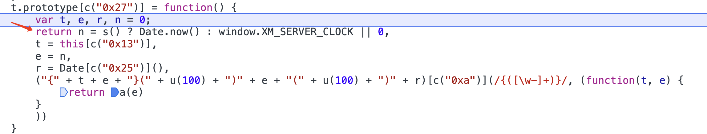

### 4、 复杂三元运算符 

```js
let a = 10;
let b = 20;
let d = a > b? a: b
console.log(d);
```

案例

```javascript
let a = 10;
let b = 20;
let c = 5;
let d = 17;
let e;
let m;

e = (e = a > 3 ? b : c, m = e < b++ ? c-- : a = 3 > b % d ? 27: 37, m++);

console.log(a);  
console.log(b); 
console.log(c); 
console.log(d);  
console.log(e); 
console.log(m);  
```

实例

```javascript
function test(){
	return (Aa() ? 0 : p("Opera")) ? a(["Version", "Opera"]) : (Aa() ? 0 : p("Edge")) ? a(["Edge"]) : Da() ? a(["Edg"]) : p("Silk") ? a(["Silk"]) : Fa() ? a(["Chrome", "CriOS", "HeadlessChrome"]) : (a = b[2]) && a[1] || ""
}
```


### 5、 JSON.stringify和JSON.parse

##### (1) **JSON.stringify**

+ 说明

  `JSON.stringify` 的作用是将 JavaScript 对象或值转换为 JSON 字符串。这个方法非常有用，因为它允许你在不同的环境中传递和存储数据，尤其是在与服务器通信或在本地存储数据时。

+ `JSON.stringify` 的主要用途：

  1. **数据传输：** 当你需要将数据从前端发送到后端（或相反）时，你可以使用 `JSON.stringify` 将 JavaScript 对象转换为 JSON 字符串，然后在服务器端使用相应的解析方法进行处理。

     ```javascript
     const dataToSend = {
       username: "Lucky",
       age: 18,
       isAdmin: false
     };

     const jsonString = JSON.stringify(dataToSend);
     // 将 jsonString 发送到服务器
     ```

  2. **本地存储：** 当你需要在浏览器的本地存储中保存数据时，可以使用 `JSON.stringify` 将对象转换为字符串，然后将字符串存储在本地。

     ```javascript
     const userPreferences = {
       theme: "Lucky",
       fontSize: 18
     };

     localStorage.setItem("userPrefs", JSON.stringify(userPreferences));
     ```

  3. **日志记录：** 在记录日志时，有时将对象转换为可读的字符串形式可以更容易地查看和分析。

     ```javascript
     const errorDetails = {
       message: "An error occurred",
       code: 500,
       timestamp: new Date()
     };

     console.log("Error details: " + JSON.stringify(errorDetails));
     ```

  4. **深拷贝：** ==通过使用 `JSON.stringify` 和 `JSON.parse` 可以执行对象的深拷贝，创建原对象的副本而不是引用==。

     ```javascript
     const originalObject = { key: "value" };
     const copiedObject = JSON.parse(JSON.stringify(originalObject));
     ```

     ==需要注意的是，`JSON.stringify` 不会包括对象的函数、`undefined` 或 `Symbol` 类型的属性。如果对象包含这些类型的属性，它们将在结果中被忽略或转换为 `null`。==

Symbol（了解）

`Symbol` 类型的属性提供了一种可靠且不容易被覆盖的属性标识符，适用于需要确保属性名唯一性的情况。

```javascript
const symbol1 = Symbol('uniqueSymbol');
const symbol2 = Symbol('uniqueSymbol');

console.log(symbol1 === symbol2); // false，因为每个 Symbol 都是唯一的

const obj = {
  [symbol1]: 'Value for symbol1',
  [symbol2]: 'Value for symbol2'
};

console.log(obj[symbol1]); // Value for symbol1
console.log(obj[symbol2]); // Value for symbol2
```


##### (2) **JSON.parse**

+ 说明

  `JSON.parse` 的作用是将 JSON 字符串解析成 JavaScript 对象。这个方法通常用于处理从服务器获取的 JSON 数据或本地存储中的 JSON 字符串。

+ ` JSON.parse` 的主要用途：

  1. **处理服务器响应：** 当你从服务器获取数据，服务器通常会以 JSON 格式发送数据。你可以使用 `JSON.parse` 将这些 JSON 数据解析为 JavaScript 对象，以便在客户端中使用。

     ```javascript
     const jsonResponse = '{"username": "Lucky", "age": 25, "isAdmin": false}';
     const userData = JSON.parse(jsonResponse);

     // 现在 userData 是一个包含服务器响应数据的 JavaScript 对象
     ```

  2. **处理本地存储数据：** 当你从本地存储中检索以 JSON 格式存储的数据时，可以使用 `JSON.parse` 将 JSON 字符串转换为 JavaScript 对象。

     ```javascript
     const storedPrefs = localStorage.getItem("userPrefs");
     const userPreferences = JSON.parse(storedPrefs);

     // userPreferences 现在是一个包含本地存储数据的 JavaScript 对象
     ```

  3. **处理用户输入：** 在某些情况下，用户可能会提供以 JSON 字符串形式输入的数据。通过使用 `JSON.parse`，你可以将用户输入转换为 JavaScript 对象，以便在应用程序中使用。

     ```javascript
     const userInput = '{"searchQuery": "vacation", "filters": {"minPrice": 100, "maxPrice": 500}}';
     const searchData = JSON.parse(userInput);

     // searchData 现在是一个包含用户输入数据的 JavaScript 对象
     ```

  4. **深拷贝：** 和 `JSON.stringify` 一起使用，`JSON.parse` 可以执行对象的深拷贝，创建原对象的副本而不是引用。

     ```javascript
     const originalObject = { key: "value" };
     const jsonString = JSON.stringify(originalObject);
     const copiedObject = JSON.parse(jsonString);
     ```

  需要注意的是，JSON 字符串必须是有效的 JSON 格式，否则 `JSON.parse` 会引发错误。在解析之前，通常会使用 `JSON.stringify` 确保生成的字符串是有效的 JSON。


### 6、本地存储

本地存储. 存储在浏览器端的数据.  可以理解成一个小型的非关系型数据库. 

+ **概述：**localStorage和sessionStorage都是HTML5提供的Web存储API，用于在浏览器中临时或持久地存储数据。
+ **作用：**存储, 获取. 删除.

#### (1) localStorage：

- localStorage是一种持久化的本地存储机制。
- 存储的数据在用户关闭浏览器后仍然保留，直到被显式删除。
- 存储的数据可以在不同的窗口、标签页或浏览器会话之间共享。
- localStorage存储的数据大小一般为5MB左右。


#### (2) sessionStorage：

- sessionStorage是一种会话级别的本地存储机制。
- 存储的数据在用户关闭浏览器窗口或标签页后自动清除。
- 存储的数据只能在当前会话期间访问，不同的窗口或标签页之间不能共享。
- sessionStorage存储的数据大小一般也为5MB左右。


#### (3) 总结

这两种存储机制都使用简单的键值对（key-value）形式来存储数据。它们都只能存储字符串类型的数据，如果需要存储其他类型的数据，可以通过序列化（如JSON.stringify）和反序列化（如JSON.parse）的方式进行转换。

总结来说，localStorage适合用于长期保存数据，而sessionStorage适合用于临时保存数据，仅在当前会话内有效。


#### (4) 使用

都继承自Storage常见的操作:

+ localStorage

  ```javascript
  localStorage.setItem(key, value);  // 设置key = value, 如果是相同的key, 会把数据覆盖
  localStorage.removeItem(key);     // 根据key删除数据
  localStorage.getItem(key);        // 根据key来获取数据
  ```

+ sessionStorage

  ```javascript
  sessionStorage.setItem(key, value);  // 设置key = value, 如果是相同的key, 会把数据覆盖
  sessionStorage.removeItem(key);     // 根据key删除数据
  sessionStorage.getItem(key);        // 根据key来获取数据
  ```


#### (5) document.cookie

+ **作用：**本地存储.   

  cookie的本质是一个超大号字符串. 有失效时间的. 

+ 设置cookie

  ```javascript
  document.cookie="name=lucky"
  ```

  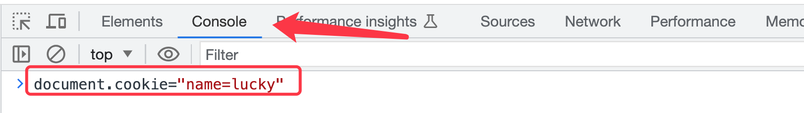

  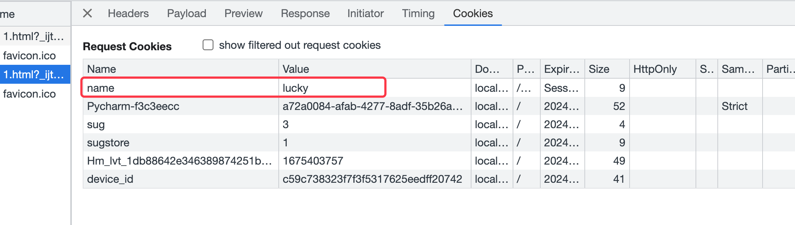

+ **获取cookie**

  想要获取cookie可以通过document.cookie直接获取. 但是如果是httponly的cookie, 是拿不到的. 需要去浏览器中进行单独的设置  取消勾选HttpOnly

  此刻cookie中有HttpOnly勾选的值，所以无法使用document.cookie进行获取

  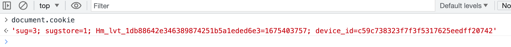

  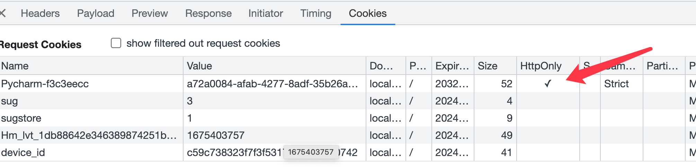

  **取消勾选  重新获取**

  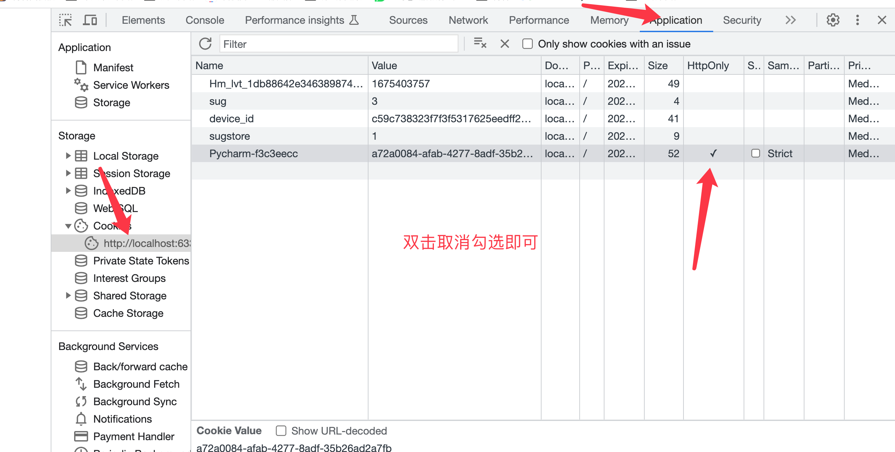

  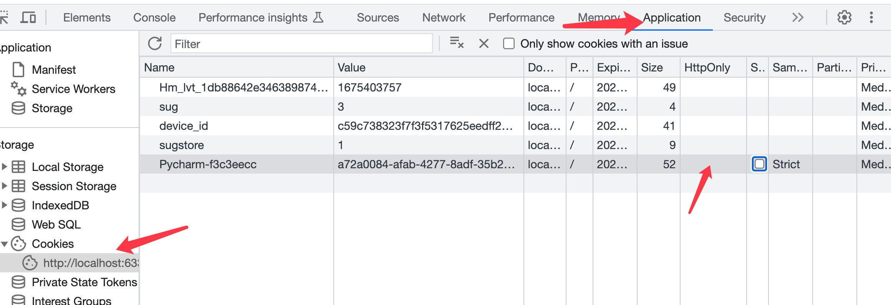

**注意：**

之前我们前面所学过的session.cookies是无法维护前端js所设置的cookie


### 7、神奇的window

#### (1) **概述：**

JavaScript中的`window`对象是浏览器提供的顶级全局对象，它代表了浏览器窗口或标签页。`window`对象具有广泛的属性和方法，用于控制和操作当前浏览器窗口或标签页。

#### (2) window实例说明

+ 我们定义一个全局变量 需要主要  全局变量使用**var**定义  **let**无法定义全局变量

  ```javascript
  // 定义
  var name = 'lucky'
  // 使用
  console.log(name)
  ```

  在浏览器中使用window对象进行查看

  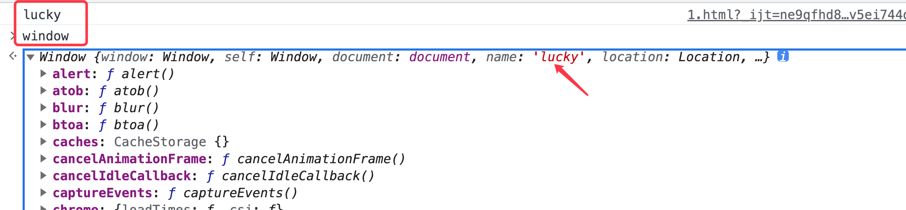

  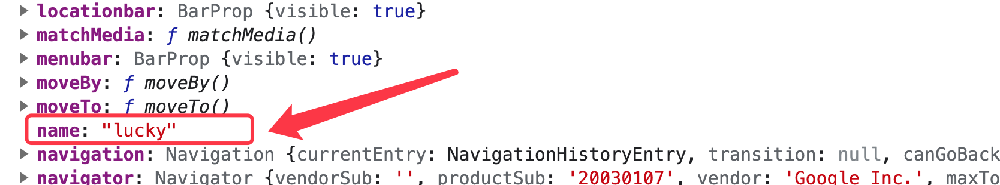

  发现此刻的name变量已经成为全局对象Window的属性  因此我们也可以如下方式进行调用

  ```javascript
  // 定义
  var name = 'lucky'
  // 使用
  console.log(window.name)
  // 等同于
  console.log(name)
  ```

+ 函数中使用

  ```javascript
  function test(){
  	window.name = 'lucky'
  }
  test()
  console.log(name)
  console.log(window.name)
  ```

综上,  我们可以得出一个结论. 全局变量可以用window.xxx来表示. 

#### (3) 下面是`window`对象的一些常见属性和方法

+ `window.document`：表示当前窗口或标签页的文档对象，可以用来操纵DOM元素和处理网页内容。
+ `window.location`：用于获取或设置当前窗口的URL信息，包括协议、主机、路径等。
  + window.location.reload()               通过js完成页面刷新
  + window.location.href = "新地址"   通过js完成页面跳转.
+ `window.navigator`：提供关于浏览器和用户代理的信息，如浏览器名称、版本、平台等。
+ `window.alert()`：在当前窗口显示一个警告框，用于向用户显示一条简单的消息。
+ `window.confirm()`：显示一个确认框，用于向用户询问一个问题，用户可以点击确定或取消按钮进行选择。
+ `window.prompt()`：显示一个提示框，用于向用户请求输入一段文本，用户可以输入并点击确定或取消按钮进行响应。
+ `window.setTimeout()`：用于在指定的时间延迟后执行一次函数或代码块。
+ `window.setInterval()`：重复调用指定的函数或代码块，按照指定的时间间隔进行重复执行。
+ `window.open()`：打开一个新的浏览器窗口或标签页，并加载指定的URL。

除了上述属性和方法，`window`对象还提供了许多其他功能，例如处理窗口尺寸、浏览器历史记录、屏幕信息等。可以通过`window`对象来操作和控制当前浏览器窗口或标签页的各个方面。

#### (4) 注意

+ window的一些特性

  在浏览器环境. 请注意. window对象和document对象是不可以被改变的.该特性非常的坑.
  如果自己补环境的时候. 请注意. 如果网站有清理window和document的代码的话.
  你补充的环境代码, 可能被冲掉

  ```javascript
  // 在浏览器环境无法改变  
  window = {}  // 无法被修改
  del window   // 无法被删除
  ```

#### (5) 其它方式的使用场景

```js
// 内部设定fun函数为全局函数
(function(){
    let fun = function(){
        console.log("fun函数设置为全局函数")
    }
    window.fun = fun
})();

fun()

//换一种写法. 你还认识么?   window作为参数传递
(function(w){
    let fun = function(){
        console.log("fun函数设置为全局函数")
    }
    w.fun = fun
})(window);


//再复杂一点
(function(w){
    let tools = {
        b64: function(){
            console.log("我是计算B64");
            return "b64";
        },
        md5: function(){
            console.log("我是计算MD5");
            return "MD5"
        }
    }
    w.jiami = {
        AES: function(msg){
            return tools.b64(),
                tools.md5(),
                'lucky';
        },
        DES: function(){
            console.log("我是DES");
        },
        RSA: function(){
            console.log("我是RSA");
        }
    }
})(window);
```

window是整个浏览器的全局作用域. 


### 8、JS原型、原型链

#### (1) 构造函数（Constructor）

javaScript中的构造函数（Constructor）是一种特殊类型的函数，用于创建对象并初始化对象的属性和方法。它们主要用于创建自定义对象类型。

构造函数在使用`new`关键字创建新对象时被调用。当一个构造函数被调用时，它会创建一个新的空对象，并将该对象作为`this`关键字的引用。构造函数可以通过`this`关键字来设置新对象的属性和方法。

以下是一个简单的构造函数的示例

```javascript
function Person(name, age) {
  this.name = name;
  this.age = age;
  this.greet = function() {
    console.log("Hello, my name is " + this.name);
  };
}

// 使用构造函数创建新对象
var person1 = new Person("迪丽热巴", 25);
var person2 = new Person("lucky", 30);

console.log(person1.name);  // 输出："迪丽热巴"
console.log(person2.age);   // 输出：30

person1.greet();  // 输出："Hello, my name is 迪丽热巴"
person2.greet();  // 输出："Hello, my name is lucky"
```

#### (2) this关键字

在JavaScript中，==构造函数是用来创建对象的特殊函数。当使用`new`关键字调用构造函数时，会创建一个新的对象，并将该对象作为`this`关键字的引用==。

`this`关键字在构造函数中的作用主要有以下几个方面：

1. 引用当前创建的对象：在构造函数中，通过`this`关键字可以引用正在创建的对象本身。这使得我们可以在构造函数中操作和设置对象的属性和方法。
2. 绑定属性和方法：通过`this`关键字，我们可以将属性和方法绑定到正在创建的对象上。例如，在构造函数中使用`this.propertyName = value`可以将属性添加到对象上，并可以通过访问`this.propertyName`来获取或修改属性的值。
3. 构建实例对象：构造函数通过`this`关键字创建的对象被称为该构造函数的实例。每次使用`new`调用构造函数时，都会创建一个新的对象实例。

总而言之，`this`关键字在构造函数中的作用是指向即将创建的对象实例，方便我们操作和设置对象的属性和方法。

代码说明：

```javascript
// 定义一个构造函数
function Person(name, age) {
  // 使用 this 关键字引用正在创建的对象实例
  this.name = name;
  this.age = age;
}

// 使用 new 关键字调用构造函数，创建一个新的对象实例
var person1 = new Person("迪丽热巴", 25);
console.log(person1.name); // 输出 "迪丽热巴"
console.log(person1.age); // 输出 25

var person2 = new Person("Lucky", 30);
console.log(person2.name); // 输出 "Lucky"
console.log(person2.age); // 输出 30
```

**注意：**

如果当前使用了new  则this为当前实例对象，如果为正常函数调用 则为全局对象window

**也就是说当前通过this创建的属性或方法会成为window对象的属性和方法**

```javascript
function Person(name, age) {
  // 使用 this 关键字引用正在创建的对象实例
  this.name = name;
  this.age = age;
  console.log(this); 
}
Person("Alice", 25);
```

直接调用则为window的属性和方法

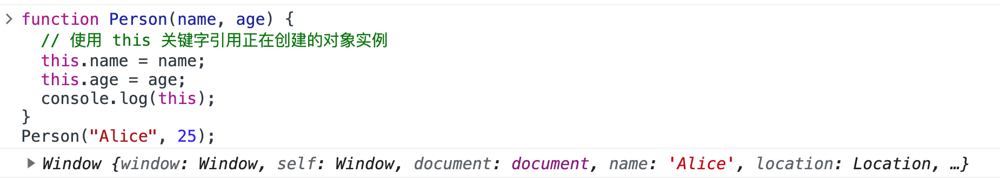

new 则为实例对象 **此处的this可以理解为python对象中的self参数 当前谁调用了则this代表是哪个对象**

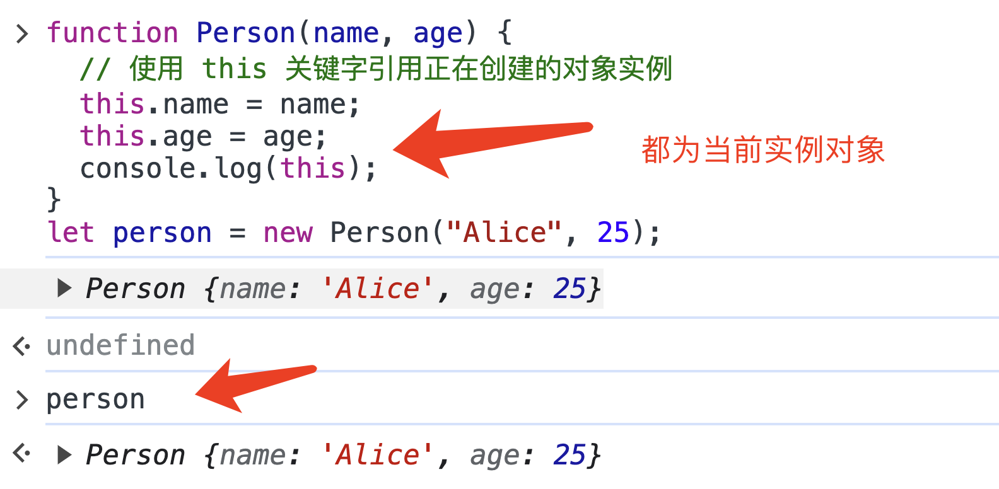

#### (3) 构造函数外添加新属性和新方法

如果你想在构造函数外部添加新的属性和方法，可以通过构造函数的原型对象来实现。这样添加的属性和方法将被所有该构造函数创建的对象所共享。

代码说明：

```javascript
function Person(name, age) {
  this.name = name;
  this.age = age;
}

// 在构造函数的原型对象上添加新属性
Person.prototype.gender = "man";

// 在构造函数的原型对象上添加新方法
Person.prototype.sayHello = function() {
  console.log("Hello, my name is " + this.name + ".");
};

var person1 = new Person("迪丽热巴", 25);
console.log(person1.name); // 输出 "迪丽热巴"
console.log(person1.age); // 输出 25
console.log(person1.gender); // 输出 "man"
person1.sayHello(); // 输出 "Hello, my name is 迪丽热巴."

var person2 = new Person("Lucky", 30);
console.log(person2.name); // 输出 "Lucky"
console.log(person2.age); // 输出 30
console.log(person2.gender); // 输出 "man"
person2.sayHello(); // 输出 "Hello, my name is Lucky."
```

在上述代码中，我们通过 `Person.prototype` 来访问构造函数的原型对象，并在原型对象上添加了属性 `gender` 和方法 `sayHello`。这样，通过构造函数创建的每个对象实例都会继承原型对象上的属性和方法。因此，无论是 `person1` 还是 `person2`，它们都可以访问相同的原型属性和方法。

通过将属性和方法添加到原型对象上，可以实现对所有对象共享的属性和方法的定义，避免在每个对象实例中都创建一份新的属性和方法，从而节省内存。

这样也使得代码更加可维护，因为我们只需要在原型对象上进行修改，就可以影响到所有对象实例。

#### (4) 什么是构造函数的原型对象

在JavaScript中，每个函数都有一个特殊的属性叫做原型（prototype）。构造函数的原型对象是一个普通的对象，它包含构造函数创建的所有实例共享的属性和方法。

==构造函数的原型对象可以被看作是用来存储共享属性和方法的“模板”。==当使用`new`关键字调用构造函数创建对象实例时，这些实例会自动继承构造函数的原型对象上的属性和方法。

通过向构造函数的原型对象上添加属性和方法，可以使得所有由该构造函数创建的对象实例都具备相同的属性和方法。这样做不仅节省了内存空间，还可实现对多个对象实例共享行为的定义。

下面简单介绍一下构造函数的原型对象的几个关键点：

1. `prototype`属性：每个函数都有一个名为`prototype`的属性，它指向构造函数的原型对象。例如，`Person.prototype`指向`Person`构造函数的原型对象。
2. `constructor`属性：原型对象上有一个特殊的属性`constructor`，它指向构造函数本身。例如，`Person.prototype.constructor`指向`Person`构造函数。
3. 原型属性和方法：可以在构造函数的原型对象上添加属性和方法。这些属性和方法将被所有实例共享。例如，`Person.prototype.gender = "man"`将在所有`Person`对象实例中添加一个名为`gender`的属性。

使用构造函数的原型对象可以实现对对象实例共享属性和方法，提高代码的效率和可维护性。它是JavaScript中面向对象编程的一个重要概念。

代码说明：

```javascript
// 构造函数
function Person(name, age) {
  this.name = name;
  this.age = age;
}

// 在构造函数的原型对象上添加属性和方法
Person.prototype.gender = "man";
Person.prototype.sayHello = function() {
  console.log("Hello, my name is " + this.name + ".");
};

// 创建对象实例
var person1 = new Person("迪丽热巴", 25);
var person2 = new Person("lucky", 30);

console.log(person1.gender); // 输出 "man"
person1.sayHello(); // 输出 "Hello, my name is 迪丽热巴."

console.log(person2.gender); // 输出 "man"
person2.sayHello(); // 输出 "Hello, my name is lucky."

console.log(Person.prototype); // 输出 { gender: 'man', sayHello: [Function] }
console.log(typeof Person.prototype); // 输出 "object"
```

**总结：**

在JavaScript中，每个函数都有一个原型对象（prototype object）。原型对象是一个普通的对象，它包含了一些可供该函数实例共享和继承的属性和方法。

当我们创建一个函数时，JavaScript会自动为该函数创建一个原型对象，并将其赋值给函数的`prototype`属性。这个原型对象是一个空对象，但可以通过给它添加属性和方法来定义需要共享的内容。

原型对象在JavaScript中实现了基于原型链的继承机制。当我们使用这个函数创建实例对象时，实例对象会继承原型对象上的属性和方法。如果实例对象在自身找不到某个属性或方法，它会沿着原型链向上查找，直到找到对应的属性或方法或者到达原型链的顶端。

通过在原型对象上定义属性和方法，可以有效地实现函数的复用和共享。所有通过同一个构造函数创建的实例对象都可以访问和共享原型对象上的属性和方法，从而节省了内存空间。

总结而言，JavaScript中的函数原型对象是一个普通的对象，它包含了函数实例共享和继承的属性和方法。通过原型对象，可以实现函数的复用和共享，以及基于原型链的继承机制。

#### (5) \_\_proto\__ 的使用

`__proto__` 是每个 JavaScript 对象都具有的属性，它指向对象的原型。它可以用于访问和操作对象的原型链。

`__proto__` 的作用和使用如下：

1. 访问原型链：通过`__proto__` 属性，可以访问对象的原型链上的属性和方法。例如：`obj.__proto__.methodName()` 可以调用原型对象上的方法。

2. 获取原型对象：使用 `__proto__` 属性可以获取对象的原型对象。例如：`var protoObj = obj.__proto__;` 通过这种方式可以获取到对象的原型对象，进一步操作原型对象。

3. 动态修改原型链：可以通过`__proto__`属性在运行时动态改变一个对象的原型。这可以通过将一个新对象赋值给`__proto__`来实现。然而，这种做法在现代 JavaScript 中已经被废弃，不推荐使用。更好的做法是使用`Object.setPrototypeOf()`方法来设置对象的原型。

   ```javascript
   var obj = person1.__proto__
   obj['name'] = 'lucky'
   Object.setPrototypeOf(person1,obj)  // 给原型对象添加新属性  
   // 注意 如果直接给空对象 则会覆盖掉原有的值
   Object.setPrototypeOf(person1, {}) 
   ```

   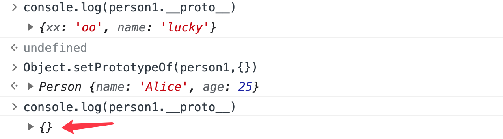

需要注意的是，尽管`__proto__` 在某些情况下可能会有用，但它并不是标准的 JavaScript API，而是非标准的属性，不建议在正式的应用程序中直接使用它。相反，推荐使用标准的`Object`方法，如`Object.getPrototypeOf()` 和 `Object.setPrototypeOf()` 来访问和修改对象的原型链。这些方法提供了更安全和可靠的方式来操作对象的原型。


#### (6)  prototype和\__proto__的区别

`prototype`和`__proto__`是JavaScript中两个相关但不同的概念。

1. `prototype`：这是一个函数特有的属性。每个函数在创建时都会自动拥有一个`prototype`属性，它是一个指向原型对象的引用。该原型对象被用作构造函数创建的对象实例的基础，因此构造函数的原型对象上定义的属性和方法可以被所有实例共享。
2. `__proto__`：这是每个JavaScript对象（包括函数）都具有的属性，它指向对象的原型。`__proto__`属性提供了对对象原型的链接，通过该链接，可以从一个对象访问到另一个对象的属性和方法。它是一个内部属性，通常不应直接使用，而是使用`Object.getPrototypeOf()`或`Object.setPrototypeOf()`方法来访问或修改对象的原型。

区别如下：

- `prototype`是函数特有的属性，而`__proto__`是每个对象都有的属性。
- `prototype`用于定义构造函数创建的对象实例的共享属性和方法，而`__proto__`用于访问对象实例的原型链。
- `prototype`存在于函数内部，是函数的一个属性；`__proto__`存在于对象实例内部，是对象的一个属性。

需要注意的是，尽管`__proto__`在现代JavaScript中仍然有效，但它已经被视为过时的方式，我们通常建议使用`Object.getPrototypeOf()`和`Object.setPrototypeOf()`方法来操作对象的原型链。

下面是使用代码来说明`prototype`和`__proto__`的区别：

```javascript
// 构造函数
function Person(name, age) {
  this.name = name;
  this.age = age;
}

// 在构造函数的原型对象上添加属性和方法
Person.prototype.gender = "man";
Person.prototype.sayHello = function() {
  console.log("Hello, my name is " + this.name + ".");
};

// 创建对象实例
var person1 = new Person("迪丽热巴", 25);
var person2 = new Person("Lucky", 30);

console.log(person1.__proto__); // 输出 { gender: 'man', sayHello: [Function] }
console.log(person2.__proto__); // 输出 { gender: 'man', sayHello: [Function] }

console.log(Person.prototype); // 输出 { gender: 'man', sayHello: [Function] }
console.log(typeof Person.prototype); // 输出 "object"

console.log(person1.prototype); // 输出 undefined
console.log(person2.prototype); // 输出 undefined

Object.setPrototypeOf(person1, {}) // 只有当前person1原型对象为空 其它对象不受影响
```

在上述代码中，我们定义了一个名为`Person`的构造函数，并在其原型对象上添加了属性`gender`和方法`sayHello`。然后，我们创建了两个对象实例`person1`和`person2`。

通过访问对象实例的`__proto__`属性，我们可以获取到对象实例的原型对象。在本示例中，`person1.__proto__`和`person2.__proto__`都指向构造函数`Person`的原型对象`Person.prototype`。

此外，我们还输出了`Person.prototype`和`typeof Person.prototype`的结果。这里可以看到，`Person.prototype`是一个包含了构造函数原型属性和方法的对象，而`typeof Person.prototype`返回的是`object`。

最后，我们尝试访问`person1.prototype`和`person2.prototype`，发现它们都是`undefined`。这是因为`prototype`是构造函数特有的属性，它用于定义对象实例的原型链，而不是对象实例自身的属性。

#### (7) 深入原型链

+ 对象.\__proto\_\_.\_\_proto__

  这个比较绕了. 我们从前面的学习中, 了解到. 每个对象身体里. 都隐藏着`__proto__`也就是它的`原型对象`. 那么我们看哈, `原型对象`也是`对象`啊, 那么也就是说. `原型对象`也有`__proto__`属性. 

  类似于.....这样:

  ```python
  person1.__proto__.__proto__
  ```

  打印出来的效果是这样的: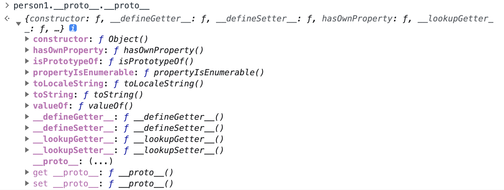

  此时. 又出现一堆看不懂的玩意. 这些玩意是什么?  这些其实是Object的原型.

  就类似于python中的所有类默认继承的都是最终的父类object一样

  ```
  person1.__proto__.__proto__ === Object.prototype
  ```

  所以, 我们在执行`person1.toString()`的时候不会报错.   反而可以正常运行. 原因就在这里. 

  执行过程:  先找`person1对象`中是否有`toString`. 没有, 找它的`原型对象`.`原型对象`中没有, 继续找`原型对象的原型对象`. 直至你找到Object的原型为止. 如果还是没有. 就报错了. 

  ```
  person1.lucky()  // 报错. 
  ```

  综上, `原型链是js 方法查找的路径指示标`.  


#### (8) 构造函数的继承

在 JavaScript 中，构造函数可以通过继承来共享属性和方法。下面介绍几种常见的构造函数继承的方式。

1. 原型链继承： 原型链继承是最基本的一种继承方式。子类的原型对象通过指向父类的实例来实现继承。这样子类就可以访问到父类原型上的属性和方法。

   ```javascript
   function Parent() {
     this.name = 'Parent';
   }
   Parent.prototype.sayHello = function() {
     console.log('Hello, I am ' + this.name);
   }

   function Child() {
     this.name = 'Child';
   }
   Child.prototype = new Parent(); // 子类的原型指向父类的实例

   var child = new Child();
   child.sayHello(); // 输出 "Hello, I am Child"
   ```

2. 构造函数继承（借用构造函数）： 通过在子类中调用父类构造函数，并使用 `call` 或 `apply` 方法将父类的属性和方法绑定到子类上，实现对父类属性的继承。

   ```javascript
   function Parent() {
     this.name = 'Parent';
     this.sayHello = function() {
       console.log('Hello, I am ' + this.name);
     }
   }

   function Child() {
     Parent.call(this); // 调用父类构造函数，并传入子类的上下文
     this.name = 'Child';
   }

   var child = new Child();
   child.sayHello(); // 输出 "Hello, I am Child"
   ```

3. 组合继承： 组合继承结合了原型链继承和构造函数继承的优点，既可以继承父类原型上的属性和方法，又可以在子类中调用父类的构造函数来继承实例属性。

   ```javascript
   function Parent() {
     this.name = 'Parent';
   }
   Parent.prototype.sayHello = function() {
     console.log('Hello, I am ' + this.name);
   }

   function Child() {
     Parent.call(this); // 调用父类构造函数，并传入子类的上下文
     this.name = 'Child';
   }
   Child.prototype = new Parent(); // 子类的原型指向父类的实例
   Child.prototype.constructor = Child; // 修复子类原型的 constructor 属性

   var child = new Child();
   child.sayHello(); // 输出 "Hello, I am Child"
   ```

4. ES6 的 class 继承： ES6 引入了 class 关键字，提供了更简洁的语法来实现面向对象编程。使用 `extends` 关键字可以实现类的继承。

   ```javascript
   class Parent {
     constructor() {
       this.name = 'Parent';
     }
   
     sayHello() {
       console.log('Hello, I am ' + this.name);
     }
   }
   
   class Child extends Parent {
     constructor() {
       super(); // 调用父类的构造函数
       this.name = 'Child';
     }
   }
   
   let child = new Child();
   child.sayHello(); // 输出 "Hello, IO am Child"
   ```

这些是几种常见的构造函数继承方式。

#### (9) 图解

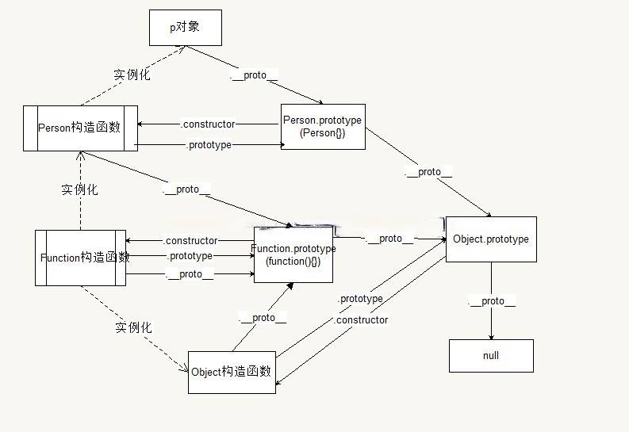

图中有几个难点：

1. Function构造函数可以用Function.\__proto__来访问Function.prototype. 这是因为Function构造函数的构造函数是他本身，作为实例化对象的角色来访问，可行。

2. 任何函数都是函数，他都继承Function的所有属性和方法，而Function是内置的构造函数，也是对象，都是继承Object的所有属性和方法。


### 9、无限debugger

##### 前言

我们用原型链能做什么?

我们来看一段神奇的代码. 

```js
(function(){debugger})();
```

这样一段代码可以看到. 浏览器进入了debugger断点. 

那么这段代码的背后是什么呢?  注意. 在js代码执行时. 每一个function的对象都是通过Function()来创建的. 也就是说. 函数是Function()的对象. 

```js
function fn(){}
console.log(fn.__proto__.constructor); // ƒ Function() { [native code] }
```

函数就是Function的对象. 那么. 我们可以通过Function来构建一个函数. 

```js
new Function('debugger')();
```

跑起来的效果一样的. 

+ **概述：**

无限调试器（Infinite Debugger）是一个开发工具，用于帮助程序员在软件开发过程中进行调试，对于我们爬虫来说，是一种网站的反扒机制

#### (1) 明文debugger

+ **代码：**

  ```javascript
  <script>
      setInterval(function (){
          debugger;
      }, 1000);
      // 每隔一秒执行一次debugger
  </script>
  ```

  **解决方式：**

  + Never pause here (推荐使用)

    找到出现debugger的位置  点击debugger 右键选择Never pause here即可

    如果出现多个debugger ，重复刚才的操作即可

    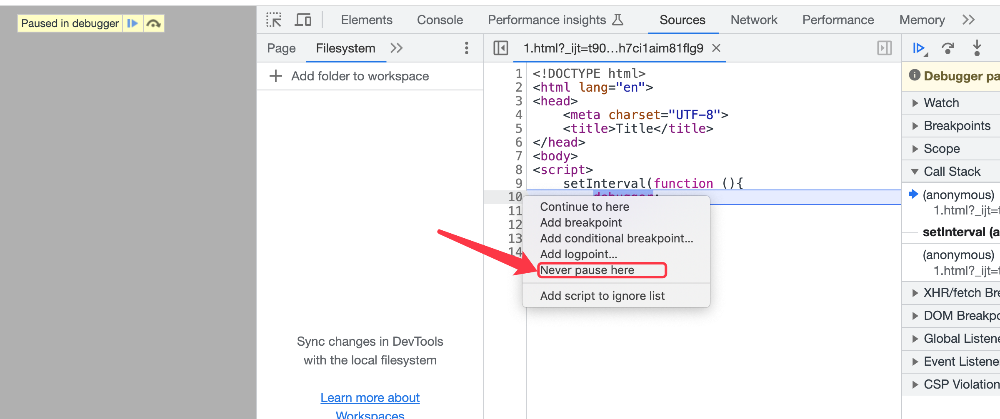

+ 重写setInterval方法

  + 先设置断点  并  点击如图所示位置  调出console功能栏  **然后刷新**

    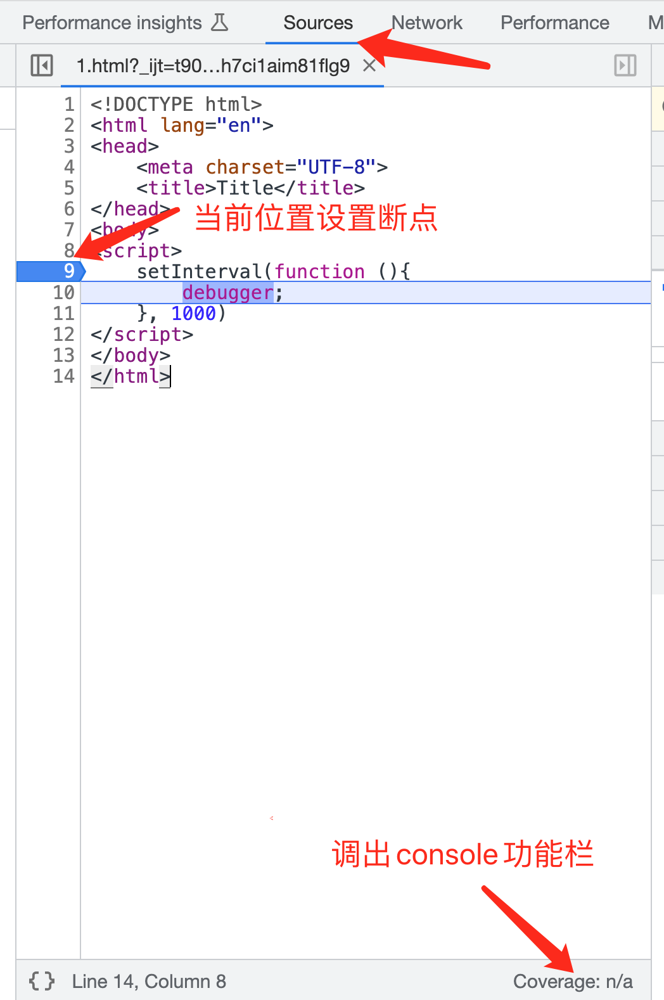

  + 在console中重写setIntervel方法（**操作当前之前需要刷新 让断点断到1这个位置**）

    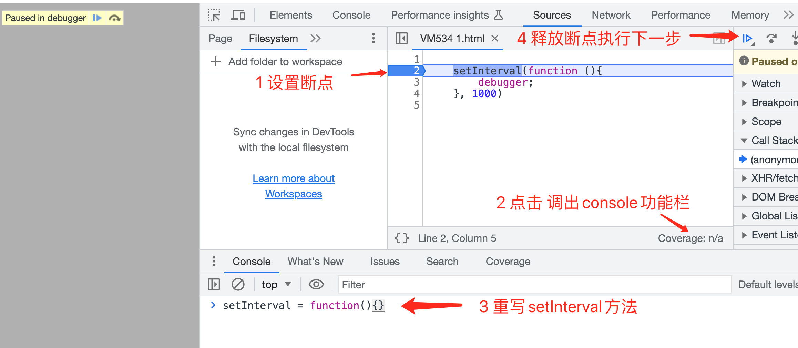


##### hook---setInterval

+ 业务代码和 setInterval 无关

  ```javascript
  setInterval = function(){}
  ```

+ 业务代码和 setInterval 无关

  ```javascript
  // hook 定时器函数 替换debugger
  _setInterval = setInterval
  setInterval = function setInterval(code, time){
      console.log(code, time)
      code = code.toString().replace(/debugger/, "").replace(/function ()/, "function xxx")
      return _setInterval(new Function(code) , time)
  }
  ```

##### hook---setTimeout

```javascript
_setTimeout = setTimeout
setTimeout = function setTimeout(code, time){
    console.log(code, time)
    code = code.toString().replace(/debugger/, "").replace(/function ()/, "function xxx")
    return _setTimeout(new Function(code), time)
}
```


#### (2) 隐式debugger（就是看起来不明显 用的较多）

+ 代码

  ```javascript
  setInterval(function (){
  		(function(params) {}).constructor('debugger;')()
    	//(function(params) {})['constructor']('debugger;')()
  }, 1000)
  ```

+ 解决

  hook

  ```javascript
  let p = Function.prototype.constructor;
  Function.prototype.constructor = function(arg) {
          arg = arg.replaceAll("debugger", "");
          return p(arg);
   }
  ```

#### (3) js混淆 无限debugger

+ 代码

  ```html
  <!DOCTYPE html>
  <html lang="en">
  <head>
      <meta charset="UTF-8">
      <title>Title</title>
  </head>
  <body>
  <script>
      function txsdefwsw() {
          var r = "V", n = "5", e = "8";

          function o(r) {
              if (!r) return "";
              for (var t = "", n = 44106, e = 0; e < r.length; e++) {
                  var o = r.charCodeAt(e) ^ n;
                  n = n * e % 256 + 2333, t += String.fromCharCode(o)
              }
              return t
          }

          try {
              var a = 'debugger';
              !function c(r) {
                  (1 !== ("" + r / r).length || 0 === r) && function () {
                  }.constructor(a)(), c(++r)
              }(0)
          } catch (a) {
              setTimeout(txsdefwsw, 100);
          }
      }
      txsdefwsw()
  </script>
  </body>
  </html>
  ```

+ 解决

  使用以上方式即可


### 10、call和apply

+ **概述**

  在 JavaScript 中，`call` 和 `apply` 是用于调用函数的方法，它们的作用是改变函数执行时的上下文（即函数内部的 `this` 指向）。

+ call 使用方式

  `call` 方法可以接受一个指定的上下文对象和多个参数。它的语法是：

  ```javascript
  function.call(thisArg, arg1, arg2, ...)
  ```

  其中，`thisArg` 是要绑定的上下文对象，`arg1`, `arg2`, ... 是传递给函数的参数。

+ apply 使用方式

  `apply` 方法与 `call` 类似，但是它接受一个指定的上下文对象和一个参数数组

  ```javascript
  function.apply(thisArg, [argsArray])
  ```

  其中，`thisArg` 是要绑定的上下文对象，`argsArray` 是一个包含传递给函数的参数的数组。

+ 注意：

  无论是 `call` 还是 `apply` 方法，当调用它们时，会立即执行函数，并且将函数中的 `this` 绑定到提供的上下文对象上。这样，函数在执行时，就可以访问到上下文对象中的属性和方法。

  需要注意的是，如果不传入上下文对象或者传入 `null` 或 `undefined`，那么在非严格模式下，默认的上下文对象将是全局对象（即 `window`）。在严格模式下，默认的上下文对象将是 `undefined`。

+ 实例

  ```javascript
  function greet(name) {
    console.log(`Hello, ${name}! My name is ${this.name}.`);
  }

  const person1 = { name: 'lucky' };
  const person2 = { name: 'Bob' };

  greet.call(person1, '迪丽热巴'); // 输出：Hello, 迪丽热巴! My name is lucky.
  greet.apply(person2, ['迪丽热巴']); // 输出：Hello, Jerry! My name is Bob.
  ```

+ 扩展

  获取Object中自带的属性的名称（）可以在这里看到object属性自带apply和call

  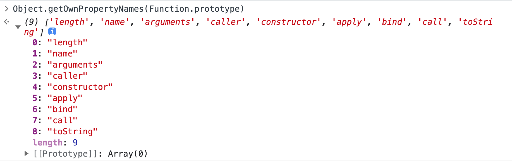


### 11、Hook

#### (1) 概述

在JavaScript中，"hook"（钩子）是一种编程模式，用于在特定的代码片段或函数执行之前或之后插入自定义逻辑。它允许开发人员拦截和修改代码的执行过程。

#### (2) Hook  实例

+ Hook  eval函数实例

  ```python
  eval_ = eval; // 先保存系统的eval函数
  eval = function(s){
      console.log(s);
      debugger;
      return eval_(s);
  }
  eval()
  ```

+ Hook cookie

  在网站有对cookie进行设置或者获取的时候 将被触发

  ```javascript
  (function(){
    var temp = "";
    Object.defineProperty(document, "cookie", {
        set(val){
          debugger;
          temp = val;
          return temp;
        },
        get(){
          debugger;
          return temp;
        }
    })
  })();
  ```

  当前操作有对cookie进行操作便会被hook 执行到当前debugger 

  url： http://iwencai.com/

  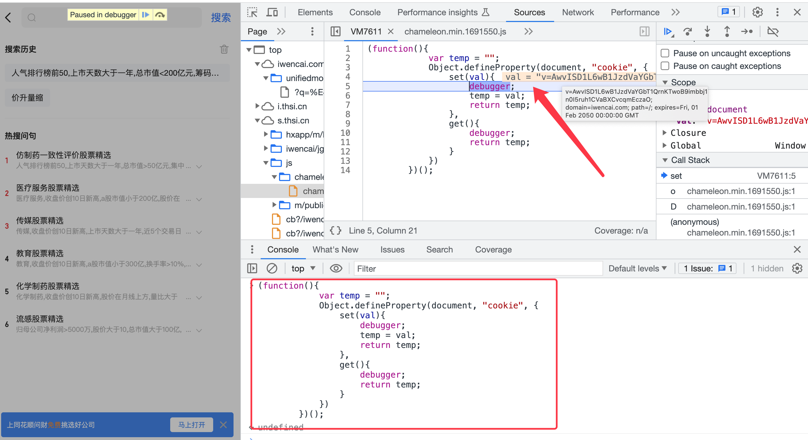

  查看当前js中进行cookie设置的代码位置

  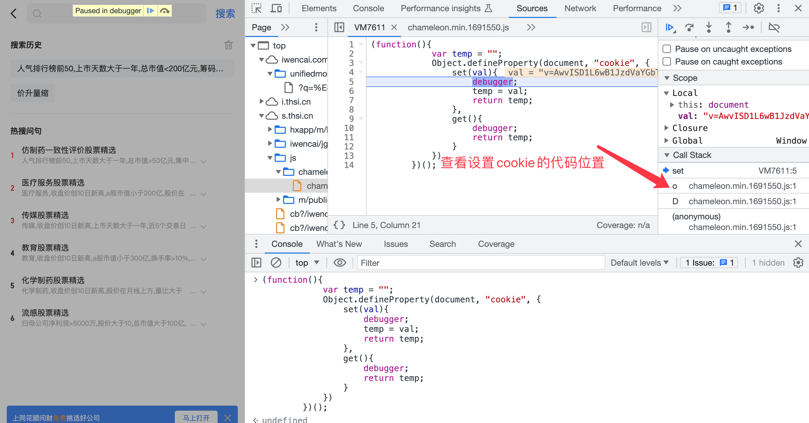

  js代码位置

  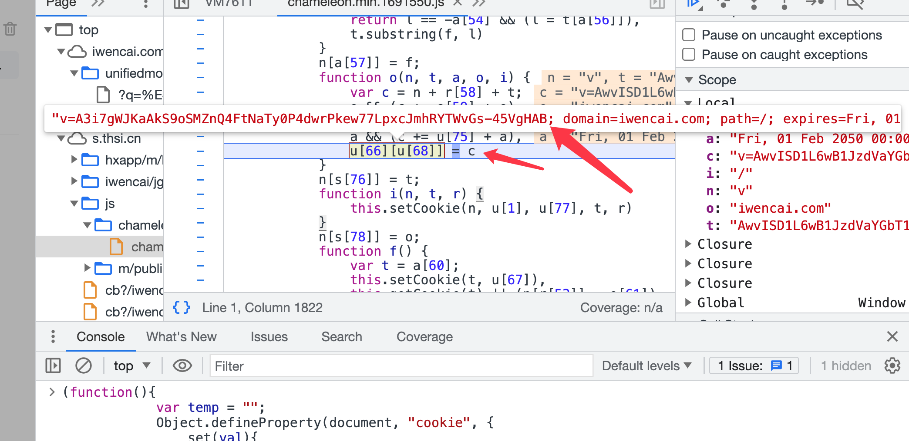

+ 用Hook的方式实现xhr断点

  url: http://www.baidu.com

  代码

  ```javascript
  XMLHttpRequest.prototype.send_ = XMLHttpRequest.prototype.send
  XMLHttpRequest.prototype.send = function(){debugger;}
  ```

  当我们百度翻页的时候 就可以看到 断点hook了

  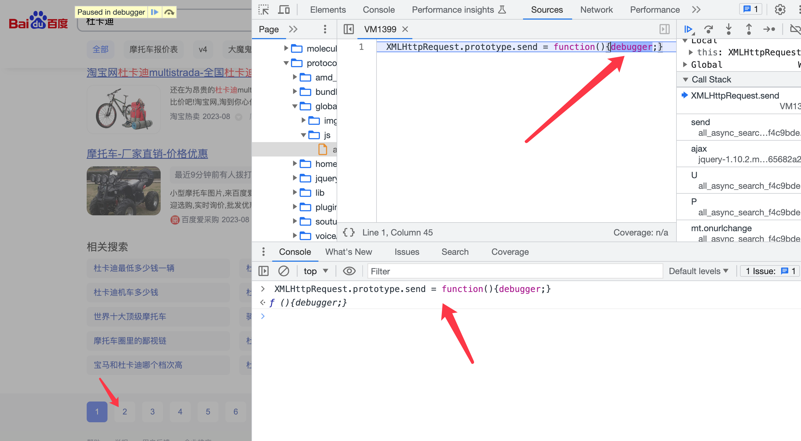

#### (3) apply在hook中的使用

+ 代码

  不固定个数参数处理

  ```javascript
  function fn(a, b, c, d){
    var e = arguments[4]; // arguments里面可以装所有参数
    return a + b + c + d + e;
  }
  
  fn(1,2,3,4,5,6);
  
  // hook fn
  var fn_ = fn;
  fn = function(a, b, c, d){
    // 中间植入你的逻辑
    // 返回原逻辑的结果
    // return fn_(a, b, c, d); // fn(1,2,3,4)  丢参数
    return fn_.apply(this, arguments);
  }
  
  fn(1,2,3,4,5,6);
  ```

####  (4) 几种hook的公式

+ 函数Hook公式

  ```javascript
  old_func = func
  func = function(argument){
  		my task;
  		return old_func.apply(argument)
  }
  func ：要hook的函数
  ```

+ 对象中属性Hook公式

  ```javascript
  old_attr = obj.attr;
  Object.defineProperty(obj, "attr", {
  	get: function() {
        console.log(cookie_cache);
        return old_attr
  	},
  	set: function(val) {
  		return …
    })
  );
  ```

+ 原型链hook（split为例）

  ```javascript
  string.prototype.split_bk=string.prototype.split;
  
  string.prototype.split=function(val){
      str=this.tostring()
      debugger;
      return str.split_bk(val)
  }
  
  a="加密字符串"
  
  a.split("加密")
  ```

#### (5) 总结

为什么使用hook？

+ hook JSON.stringify, JSON.parse   

+ 针对函数. 找 `加密入口` 或 `解密入口`前后端传值的逻辑:

  准备url, 以及请求参数.
  am = {name: xxx, age: xxx}

  对参数进行处理(处理成字符串)

   JSON.stringify(obj);  把js中的对象.处理成json字符串

  对参数或者url进行加密 (对字符串加密)

+ 在逆向时, 常用的主要有: hook eval 、hook Function 、hook JSON.stringify、JSON.parse 、setInterval,  setTimeout, hook cookie

#### (6) hook实例

+ cookie   查看当前js在哪个位置设置的cookie 生成cookie的代码

  https://www.iwencai.com/unifiedwap/result?w=%E6%9C%80%E8%BF%91%E4%B8%89%E5%B9%B4%E7%B4%AF%E8%AE%A1%E7%8E%B0%E9%87%91%E5%88%86%E7%BA%A2%E9%87%91%E9%A2%9D%E4%BD%8E%E4%BA%8E%E6%9C%80%E8%BF%91%E4%B8%89%E5%B9%B4%E5%B9%B4%E5%9D%87%E5%87%80%E5%88%A9%E6%B6%A630%25&querytype=stock&addSign=1701099054678

  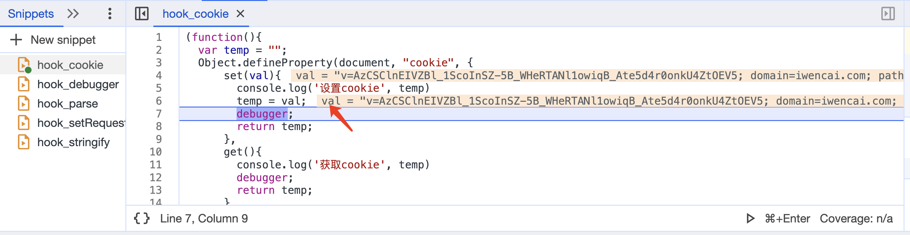

+ debugger  

  + **url:**  https://web.mypitaya.com/login  

    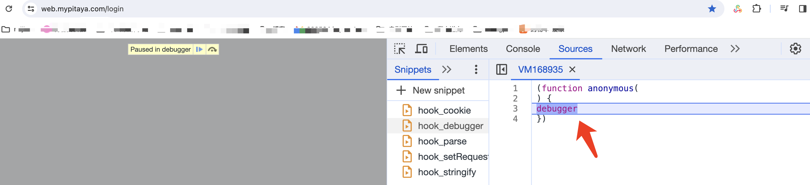

    通过调用栈来查看当前debugger的方式 为constructor

  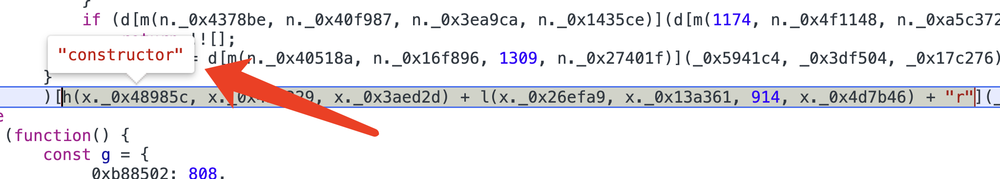

  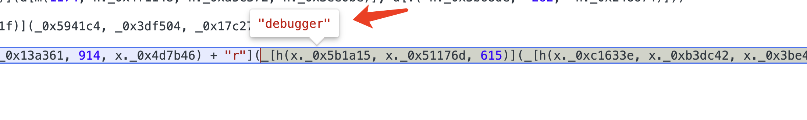

  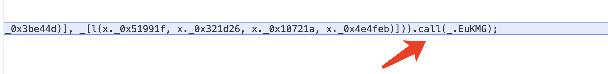

  + 代码

    ```javascript
    let p = Function.prototype.constructor;
    Function.prototype.constructor = function(arg) {
            arg = arg.replaceAll("debugger", "");
            return p(arg);
     }
    ```

+ **eval**

  ```javascript
  eval_ = eval;
  eval = function(a){if(a=='debugger'){return ''}else{return eval_(a)}}    
  ```

+ ##### setInterval

  + 业务代码和 setInterval 无关

    ```javascript
    setInterval = function(){}
    ```

  + 业务代码和 setInterval 无关

    ```javascript
    // hook 定时器函数 替换debugger
    _setInterval = setInterval
    setInterval = function setInterval(code, time){
        console.log(code, time)
        code = code.toString().replace(/debugger/, "").replace(/function ()/, "function xxx")
        return _setInterval(new Function(code) , time)
    }
    ```

+ **setTimeout**

  ```javascript
  _setTimeout = setTimeout
  setTimeout = function setTimeout(code, time){
      console.log(code, time)
      code = code.toString().replace(/debugger/, "").replace(/function ()/, "function xxx")
      return _setTimeout(new Function(code), time)
  }
  ```


### 12、 ES6中的promise(难)

#### (1)  概述

在JavaScript中，Promise（承诺）是一种用于处理异步操作的特殊对象。它可以将异步操作封装成一个可控制的状态，并通过链式调用来处理操作的结果。

#### (2) Promise有三个状态：

1. Pending（进行中）：初始状态，表示异步操作正在进行中。
2. Fulfilled（已成功）：表示异步操作已成功完成。
3. Rejected（已失败）：表示异步操作发生了错误或失败。

#### (3) 创建一个Promise对象的语法如下：

```javascript
const myPromise = new Promise((resolve, reject) => {
  // 异步操作代码
});
```

+ 参数说明

  resolve  成功后调用的方法

  reject      失败后调用的方法

+ 注意

  当前参数名称不一定就为resolve  和 reject   但是代表含义是一样的

#### (4) 使用场景

在Promise对象中，通常会执行一些异步操作，比如请求数据、读取文件等。这些异步操作可以是回调函数、定时器、网络请求等。当操作完成时，可以使用`resolve`方法将Promise状态改为Fulfilled，并传递操作结果；或者使用`reject`方法将Promise状态改为Rejected，并传递错误信息。

#### (5) .then() .catch()  .finally 方法

+ then()

  当new Promise返回的当前成功或失败的结果后进行调用成功或者失败的方法 参数可为一个或者俩个参数 一个参数为只有成功才调用  二个参数分别包含成功和失败进行调用的方法

+ catch()

  当new Promise返回为失败的结果进行调用

+ finally 

  无论new Promise返回为什么结果都会进行调用

+ myPromise

  ```javascript
  function myPromise() {
          return new Promise(function(resolve, reject) {
              console.log("现在请求到这里了")
              if (Math.random() < 0.5) {
                // 操作成功，将Promise状态改为Fulfilled，并传递结果
                resolve(randomNumber); 
              } else {
                // 操作失败，将Promise状态改为Rejected，并传递错误信息
                reject("Error occurred"); 
              }
          })
  }
  ```

+ then方法的一个参数 只有成功才会调用     搭配catch捕获失败后进行调用处理的方法

  ```javascript
  myPromise.then(success_result => {
    // 操作成功的处理代码
    console.log('成功', success_result)
  }).catch(error => {
    // 操作失败的处理代码
    console.log('失败', error)
  }).finally(() => {
      console.log("无论操作成功或失败，都会执行该回调函数");
  });
  ```

+ then方法的二个参数 分别为成功和失败进行调用

  ```javascript
  myPromise.then(success_result => {
    // 操作成功的处理代码
    console.log('成功', success_result)
  },error_result => {
  	// 操作失败的处理代码
    console.log('失败', error_result)
  }).finally(() => {
      console.log("无论操作成功或失败，都会执行该回调函数");
  });
  ```

  此刻不能搭配catch方法  因为then中已经存在失败进行调用的方法

+ 说明

  在`.then()`方法中，可以定义成功时的回调函数，该函数将接收到操作成功后的结果作为参数。如果操作出现错误，则可以通过`.catch()`方法捕获并处理错误信息。

  除了`.then()`和`.catch()`，还可以使用`.finally()`方法，无论Promise对象的状态如何，都会执行其中的回调函数。

  另外，Promise还支持多个操作的并行执行和串行执行，可以使用`Promise.all()`方法将多个Promise对象包装成一个新的Promise对象，当所有操作都成功完成时，该新的Promise对象才会进入Fulfilled状态；或者使用`Promise.race()`方法将多个Promise对象包装成一个新的Promise对象，当其中任意一个操作完成时，该新的Promise对象就会进入相应的状态。

  Promise在处理异步操作时提供了更直观、可读性更高的代码结构，并且避免了回调地狱的问题，使得异步代码更易于编写和维护。

#### (6) 使用实例

+ 代码

  ```javascript
  // 模拟异步操作，延迟1秒钟后返回结果
  function asyncOperation() {
    return new Promise((resolve, reject) => {
      setTimeout(() => {
        const randomNumber = Math.random();
        if (randomNumber < 0.5) {
          resolve(randomNumber); // 操作成功，将Promise状态改为Fulfilled，并传递结果
        } else {
          reject("Error occurred"); // 操作失败，将Promise状态改为Rejected，并传递错误信息
        }
      }, 1000);
    });
  }

  // 使用Promise对象进行异步操作处理
  asyncOperation()
    .then(result => {
      console.log("操作成功，结果为：" + result);
    })
    .catch(error => {
      console.log("操作失败，错误信息为：" + error);
    })
    .finally(() => {
      console.log("无论操作成功或失败，都会执行该回调函数");
    });
  ```

+ js逆向中的promise

  ```javascript
  function l(e, t, o) {
    return new Promise((n,c)=>{
    	a["a"].post(e, t, o).then(e=>{
    	n(e.data)
    }).catch(e=>{
    	c(e)
    })}
  )};
  ```

