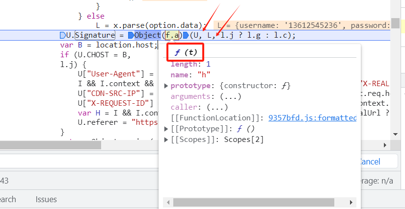
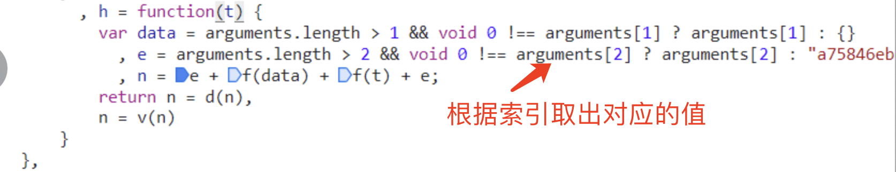
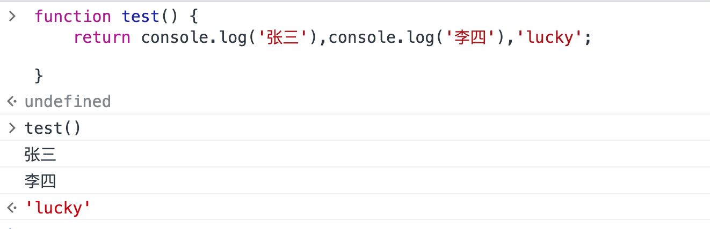

# 函数

## 一、函数的定义

JavaScript三种定义函数方法：

### 1、 function语句定义函数

+ 格式

  ```javascript
  function 函数名(参数1[,参数2...]) {
      return y * y;
  }
  ```

+ 定义

  ```javascript
  function myFunction(y) {
      return y * y;
  }
  ```

+ 调用

  ==不区分位置（函数定义上方或下方）==

  return后面的代码不再执行。

  ```javascript
  myFunction(5);
  ```

+ 形参和实参个数对应不上也不会报错

  实参小于形参个数  则没有值的形参的值为undefined

  实参大于形参个数  则形参和实参的值对应 超出的没有任何变化

  ```javascript
  myFunction(5, 6);
  ```

+ 设置默认值

  ```javascript
  function myFunction(y=2) {
      return y * y;
  }
  ```

### 2、构造函数来定义函数（不常用）

+ 格式

  ```javascript
  var 函数名 = new Function(“参数1”，”参数2”，”参数3”……”函数体”);
  ```

+ 实例

  ```javascript
  var fun = new Function("x","y","var z=x+y;return z;");
  var fun = new Function("x=1","y=2","var z=x+y;return z;");
  ```


### 3、函数表达式

+ 概述

  JavaScript 函数可以通过一个表达式定义。

+ 函数表达式可以存储在变量中：

  ```javascript
  var 函数名 = function(参数1，参数2，…){函数体};
  ```

+ 实例

  ```javascript
  //定义
  var add = function(a,b){
    return a + b;
  };
  //调用函数
  document.write(add(50,20));
  ```


### 4、箭头函数---ES6中的新简洁语法

+ 说明

  在ES6中简化了函数的声明语法.   

+ 无参函数

  ```javascript
  // 无参函数
  var fn = function(){};  // 普通写法
  var fn = () => {};      // 简洁写法
  ```

+ 一个参数函数

  ```javascript
  // 一个参数函数
  var fn = function(name){}  // 普通写法
  var fn = (name) => {}     // 简洁写法
  var fn = name => {}       // 简洁写法 一个参数可以省略小括号
  ```

+ 多个参数函数

  ```javascript
  // 多个参数函数
  var fn = function(name, age){}  // 普通写法
  var fn = (name, age) => {}      // 简洁写法
  ```


### 5、自运行函数

+ 说明

  自运行函数（Self-invoking function）是在定义之后立即执行的 JavaScript 函数。这种函数有时也被称为立即执行函数表达式（Immediately Invoked Function Expression，IIFE）。

+ 自调用函数**()**

  ```javascript
  (function () {
          var x = "Hello!!";      // 我将调用自己
          console.log(x);
  })();
  ```

+ 命名的自运行函数

  ```javascript
  (function namedFunction() {
      // 代码块
       var x = "Hello!!";      // 我将调用自己
       console.log(x);
  })();
  ```

+ 自调用函数**+**

  ```javascript
  +function () {
          var x = "Hello!!";      // 我将调用自己
          console.log(x);
  }(); 
  ```

+ 自调用函数**-**

  ```javascript
  -function () {
          var x = "Hello!!";      // 我将调用自己
          console.log(x);
  }();
  ```

+ 自调用函数**~**

  ```javascript
  ~function () {
          var x = "Hello!!";      // 我将调用自己
          console.log(x);
  }();
  ```

+ 自调用函数 **!**

  ```javascript
  !function () {
          var x = "Hello!!";      // 我将调用自己
          console.log(x);
  }();
  ```

+ 箭头函数形式

+ ==一般尽量不适用特殊符号的自运行 使用全括号进行自运行==

  无参

  ```javascript
  (() => {
      // 代码块
  })();
  ```

  携带参数

  ```javascript
  (name => {
      // 代码块
      console.log(name)
  })('lucky');
  ```

  

### 5、注意

关于变量和参数问题：

+ 函数外面定义的变量是全局变量，函数内可以直接使用
+ 在==函数内部没有使用var定义的变量则为全局变量==
+ 在函数内部定义的函数为局部函数 在函数外部不能获取到
+ 在函数内使用var关键字定义的变量是局部变量，即出了函数外边无法获取。
+ 函数支持默认值
+ 实参可以大于形参个数 不会报错  
+ 不可以设定关键字参数


## 二、arguments 与return

### 1、不定长参数arguments 对象

+ 概述

  在函数代码中，使用特殊对象 arguments，开发者无需明确指出参数名，就能访问它们。
  例如，在函数 sayHi() 中，第一个参数是 message。用 arguments[0] 
  也可以访问这个值，即第一个参数的值（第一个参数位于位置 0，
  第二个参数位于位置 1，依此类推）。

+ 例如：

  ```javascript
  x = sumAll(1, 123, 500, 115, 44, 88);

  function sumAll() {
      var i, sum = 0;
      for (i = 0; i < arguments.length; i++) {
          sum += arguments[i];
      }
      return sum;
  }
  ```

+ 实例

  

  

### 2、return关键字

+ 实例

  ```javascript
   function test() {
       return 'val'
       console.log('输出') // 和Python一样 return后面代码不在执行
   }
  console.log(test());
  ```

+ 如果return 后面跟了多个值

  ```javascript
   function test() {
       return console.log('张三'),console.log('李四'),'lucky';
       
   }
  console.log(test());  
  // 执行结果
  输出 张三 ，李四  返回lucky
  ```

  

+ 注意

  + 当函数体执行遇到return 下面代码不在执行
  + return将值 返回给了函数调用处
  + ==return后逗号分隔多个值为表达式 都会执行 但是最后一个才会被返回==


## 三、JavaScript 闭包

### 1、概述

+ JavaScript 变量可以是局部变量或全局变量。
+ 私有变量可以用到闭包
+ 函数内部可以修改函数外部的全局变量

### 2、计数器困境

设想下如果你想统计一些数值，且该计数器在所有函数中都是可用的。

你可以使用全局变量，函数设置计数器递增：

```javascript
var counter = 0;
 
function add() {
   return counter += 1;
}
 
add();
add();
add();
 
// 计数器现在为 3
```

但问题来了，页面上的**任何脚本都能改变计数器**，即便没有调用 add() 函数。

如果我在函数内声明计数器，如果没有调用函数将无法修改计数器的值：

```javascript
function add() {
    var counter = 0;
    return counter += 1;
}
 
add();
add();
add();
// 本意是想输出 3, 但事与愿违，输出的都是 1 !
```

### 3、JavaScript 内嵌函数

+ 概述

  ==所有函数都能访问全局变量。==   

  ==实际上，在 JavaScript 中，所有函数都能访问它们上一层的作用域。==

  ==JavaScript 支持嵌套函数。嵌套函数可以访问上一层的函数变量。== 

  该实例中，内嵌函数 **plus()** 可以访问父函数的 **counter** 变量：

+ 实例:

  ```javascript
  function add() {
      var counter = 0;
      function plus() {
        counter += 1;
      }
      plus();    
      return counter; 
  }
  ```

### 4、JavaScript 闭包

+ 第一种实现计数器

  ```javascript
  var add = (function () {
          var counter = 0;
          function inner() {
              return counter += 1;
          }
          return inner
  })();
  ```

+ 第二种  直接return 函数体

  ```javascript
  var add = (function () {
      var counter = 0;
      return function () {
        return counter += 1;
      }
  })();
   
  add();
  add();
  add();
   
  // 计数器为 3
  ```

+ 实例解析

  变量 **add** 指定了函数自我调用的返回字值。 

  ==自我调用函数只执行一次。设置计数器为 0。并返回函数表达式==。

  add变量可以作为一个函数使用。非常棒的部分是==它可以访问函数上一层作用域的计数器。== 

  这个叫作 JavaScript **闭包。**它使得函数拥有私有变量变成可能。

  计数器受匿名函数的作用域保护，只能通过 add 方法修改。

  ==闭包是可访问上一层函数作用域里变量的函数，即便上一层函数已经关闭==。

  ==闭包就是一个函数引用另一个函数的变量，因为变量被引用着所以不会被回收，因此可以用来封装一个私有变量。==这是优点也是缺点，不必要的闭包只会增加内存消耗。  或者说闭包就是子函数可以使用父函数的局部变量，还有父函数的参数。

